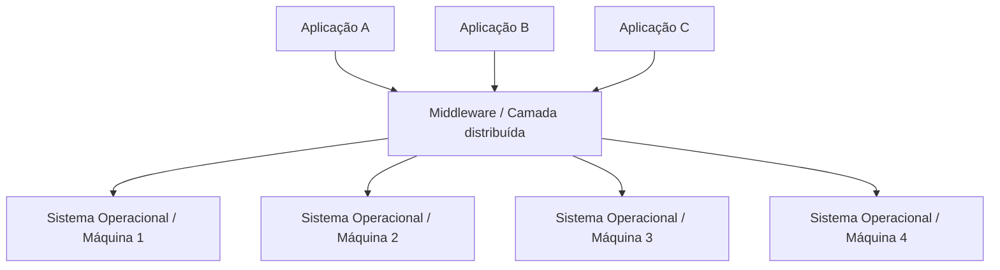
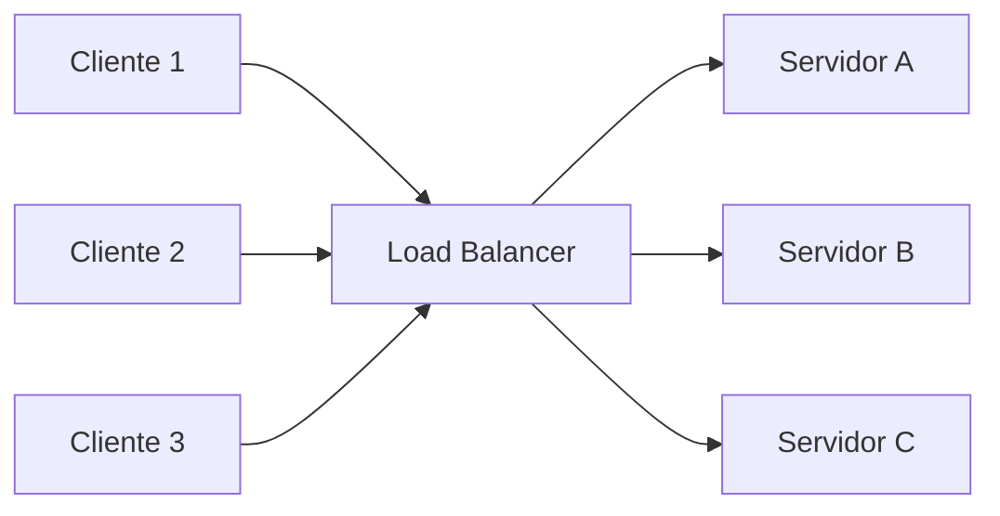

# Aula 01 — Introdução aos Sistemas Distribuídos

> **Disciplina:** Algoritmos Distribuídos e Blockchain  
> **Tema da aula:** Introdução aos Sistemas Distribuídos  

---

## Objetivos da aula

A primeira aula teve como foco construir uma base conceitual sobre **sistemas distribuídos**, preparando o caminho para o estudo posterior de **algoritmos distribuídos** e **Blockchain**.

A ideia principal da disciplina é revisar sistemas distribuídos, mas sempre com uma atenção especial à perspectiva de **segurança cibernética**. Ou seja, não basta entender como um algoritmo funciona: também é necessário observar onde podem surgir falhas, ataques, atrasos, mensagens perdidas, inconsistências e brechas de segurança.

Ao longo da aula, foram trabalhados estes pontos:

- o que é um sistema distribuído;
- quais são suas principais características;
- por que distribuir uma aplicação pode ser útil;
- por que distribuir uma aplicação também aumenta a complexidade;
- metas de sistemas distribuídos;
- transparência, abertura e escalabilidade;
- técnicas para lidar com escalabilidade;
- desafios e falsas premissas comuns em aplicações distribuídas;
- relação inicial com Blockchain, consenso e segurança.

---

## 1. O que é um sistema distribuído?

Existem várias definições clássicas para sistemas distribuídos. Cada uma enfatiza um aspecto diferente.

### Definição 1 — Tel

Um sistema distribuído pode ser visto como uma **coleção interconectada de computadores, processos ou processadores autônomos**.

A palavra importante aqui é **autônomos**. Cada computador ou processo tem sua própria capacidade de execução e não depende de uma memória física compartilhada com os demais.

### Definição 2 — Tanenbaum e Van Steen

Um sistema distribuído é um **conjunto de computadores independentes que se apresenta aos usuários como um sistema único e coerente**.

Essa definição é uma das mais importantes da área, porque junta duas ideias fundamentais:

1. internamente, existem vários computadores independentes;
2. externamente, o usuário tem a impressão de estar usando um único sistema.

Esse é um ponto central: o sistema distribuído tenta esconder parte da complexidade da distribuição. Para o usuário, não importa se a requisição foi processada em uma máquina, em dez servidores ou em uma infraestrutura espalhada por vários países. A experiência esperada é a de um serviço único.

### Definição 3 — Kshemkalyani e Singhal

Um sistema distribuído também pode ser entendido como uma **coleção de entidades independentes que cooperam para resolver um problema que não pode ser resolvido individualmente**.

Essa definição destaca a ideia de **cooperação**. O sistema distribuído existe porque há um problema grande demais, complexo demais ou crítico demais para ser resolvido de forma eficiente por uma única entidade.

### Definição 4 — Coulouris et al.

Outra definição importante diz que um sistema distribuído é aquele no qual componentes de hardware ou software, localizados em computadores interligados em rede, **comunicam-se e coordenam suas ações apenas por troca de mensagens**.

Aqui aparece um ponto técnico essencial: em sistemas distribuídos, os componentes normalmente não compartilham memória física. Eles coordenam suas ações por meio de mensagens enviadas pela rede.

---

## 2. Síntese da ideia de sistema distribuído

Juntando as definições, podemos dizer que um sistema distribuído é:

> Um conjunto de computadores, processos ou serviços independentes, conectados por uma rede, que cooperam por troca de mensagens para oferecer ao usuário a impressão de um sistema único, coerente e disponível.

Em outras palavras:

- há várias máquinas;
- cada uma possui seu próprio processador, memória e estado local;
- a comunicação acontece pela rede;
- o usuário não deve precisar conhecer a localização física dos recursos;
- o sistema precisa lidar com falhas, atrasos, concorrência e inconsistência;
- a complexidade interna deve ser ocultada sempre que isso fizer sentido.

Um exemplo simples é uma aplicação web moderna. Ao acessar uma página, o usuário vê apenas o sistema funcionando. Mas, por trás, podem existir servidores de aplicação, banco de dados, cache, balanceadores de carga, filas de mensagens, serviços externos e réplicas em diferentes regiões.

---

## 3. Principais características

### 3.1 Ocultação da complexidade

Uma característica forte dos sistemas distribuídos é a tentativa de ocultar do usuário as diferenças entre computadores, redes, sistemas operacionais, linguagens e formatos de dados.

O usuário não precisa saber:

- em qual máquina o recurso está armazenado;
- qual servidor processou a requisição;
- se houve redirecionamento para outra réplica;
- se algum componente falhou e outro assumiu;
- se o dado veio de um cache ou do servidor principal.

Essa ocultação é chamada, em muitos casos, de **transparência**.

### 3.2 Computadores independentes

Os computadores do sistema distribuído são independentes. Isso significa que cada nó tem seus próprios recursos e pode falhar de maneira isolada.

Essa independência é uma vantagem, porque permite aumentar o sistema com mais máquinas. Porém, também cria desafios: não existe uma memória global compartilhada, não existe um relógio global perfeito e a comunicação depende da rede.

### 3.3 Comunicação por mensagens

Como não há memória compartilhada, os componentes precisam trocar mensagens.

Essas mensagens podem:

- atrasar;
- chegar fora de ordem;
- ser duplicadas;
- ser perdidas;
- ser interceptadas;
- ser modificadas por atacantes, caso a comunicação não seja protegida.

Por isso, a rede nunca deve ser tratada como algo perfeito.

### 3.4 Disponibilidade contínua

Um sistema distribuído deve tentar permanecer disponível mesmo quando algumas partes falham.

A ideia é que o usuário não perceba, sempre que possível, que um servidor caiu, que um componente foi substituído ou que uma nova máquina foi adicionada para atender mais usuários.

Isso é muito importante em sistemas críticos, como serviços bancários, plataformas de pagamento, sistemas acadêmicos, aplicações em nuvem e infraestruturas de segurança.

### 3.5 Middleware

Para suportar computadores e redes heterogêneos e, ao mesmo tempo, oferecer uma visão de sistema único, sistemas distribuídos costumam usar uma camada de software intermediária chamada **middleware**.

O middleware funciona como uma camada entre as aplicações e os sistemas operacionais/recursos locais. Ele oferece uma interface comum para que a aplicação não precise lidar diretamente com todas as diferenças entre máquinas.

O objetivo é esconder parte da heterogeneidade e permitir que os recursos distribuídos sejam acessados de maneira mais uniforme.

---

## 4. Vale a pena distribuir?

Um ponto importante da aula foi a ideia de que **nem sempre distribuir é a melhor solução**.

O fato de ser possível construir uma aplicação distribuída não significa que essa seja automaticamente a decisão correta. Sistemas distribuídos trazem benefícios, mas também aumentam muito a complexidade.

### Benefícios comuns

Distribuir pode ser interessante quando se deseja:

- compartilhar recursos;
- reduzir custos;
- evitar duplicação de equipamentos e dados;
- aumentar disponibilidade;
- melhorar desempenho;
- suportar muitos usuários;
- processar tarefas grandes em paralelo;
- aproximar recursos dos usuários;
- tolerar falhas de componentes isolados.

### Custos e complexidades

Por outro lado, distribuir uma aplicação traz novos problemas:

- comunicação pela rede;
- latência;
- falhas de comunicação;
- sincronização entre componentes;
- consistência dos dados;
- segurança da comunicação;
- depuração mais difícil;
- monitoramento mais complexo;
- necessidade de lidar com concorrência;
- maior superfície de ataque.

A decisão de distribuir precisa considerar se os benefícios compensam os custos.

---

## 5. Metas de sistemas distribuídos

A aula apresentou quatro metas importantes para que um sistema distribuído realmente faça sentido:

1. oferecer fácil acesso aos recursos;
2. ocultar razoavelmente o fato de que os recursos estão distribuídos;
3. ser aberto, com protocolos e interfaces padronizados;
4. poder ser expandido.

Essas metas ajudam a avaliar se a distribuição está sendo bem aplicada ou se apenas tornou o sistema mais complexo.

---

## 6. Acesso a recursos

Uma das principais metas de um sistema distribuído é permitir que usuários e aplicações acessem recursos localizados em outros computadores.

Exemplos de recursos compartilhados:

- arquivos;
- bancos de dados;
- impressoras;
- serviços em nuvem;
- APIs;
- poder de processamento;
- armazenamento distribuído.

O compartilhamento de recursos pode reduzir custos e evitar duplicação. Porém, quanto mais conectividade e compartilhamento existem, maior a preocupação com segurança.

É necessário evitar:

- acesso indevido;
- interceptação de dados;
- modificação de mensagens;
- rastreamento de comunicações;
- ataques à privacidade;
- vazamento de informações sensíveis.

Na prática, sistemas distribuídos exigem autenticação, autorização, criptografia, auditoria e monitoramento.

---

## 7. Transparência da distribuição

A transparência é uma das metas mais importantes dos sistemas distribuídos.

Um sistema é transparente quando consegue se apresentar ao usuário ou à aplicação como se fosse um único sistema, mesmo sendo composto por várias partes distribuídas.

### Tipos de transparência

| Tipo de transparência | Ideia principal | Exemplo |
|---|---|---|
| Transparência de acesso | O recurso é usado da mesma forma, esteja local ou remoto. | Abrir um arquivo na nuvem de forma parecida com um arquivo local. |
| Transparência de localização | O usuário não precisa saber onde o recurso está fisicamente. | Acessar uma URL sem saber em qual servidor o site está hospedado. |
| Transparência de migração | O recurso pode mudar de servidor sem alterar a forma de acesso. | Migrar uma VM para outro servidor sem mudar o endereço de acesso. |
| Transparência de relocação | O recurso muda de lugar enquanto está sendo usado. | Uma chamada continua ativa enquanto o celular troca de antena. |
| Transparência de replicação | Existem várias cópias, mas o usuário percebe apenas um recurso. | Vídeos ou páginas servidos por réplicas diferentes. |
| Transparência de concorrência | Vários usuários acessam o mesmo recurso sem conflitos aparentes. | Muitos alunos acessando um AVA ao mesmo tempo. |
| Transparência de falha | O sistema continua funcionando mesmo após falhas de componentes. | Um servidor falha e outro assume o serviço. |

---

## 8. Nem sempre esconder tudo é a melhor solução

Uma mensagem importante da aula foi:

> Nem sempre esconder tudo é a melhor solução.

A transparência é desejável, mas não deve ser tratada como absoluta. Em alguns casos, esconder completamente a distribuição pode prejudicar o desempenho, a segurança ou até a compreensão do usuário.

### Latência: a distância física importa

A comunicação entre locais distantes leva tempo. Uma aplicação no Brasil se comunicando com um servidor na Europa, por exemplo, pode sofrer atrasos perceptíveis.

Mesmo que a aplicação tente esconder a distribuição, a distância física ainda influencia o tempo de resposta.

### Consistência: manter cópias sincronizadas leva tempo

Quando há várias réplicas de um dado, todas precisam ser atualizadas após uma modificação.

Isso pode levar tempo. Em alguns sistemas, pequenas diferenças temporárias são aceitáveis. Em outros, como sistemas bancários e bolsas de valores, a consistência precisa ser muito mais rígida.

### Localização: às vezes a localização importa

Em alguns casos, saber onde o recurso está pode melhorar o desempenho ou reduzir custos.

Um exemplo simples é imprimir em uma impressora próxima, em vez de enviar o documento para uma impressora em outro prédio ou outra localidade.

---

## 9. Abertura

Outra meta importante é a **abertura**.

Um sistema distribuído aberto utiliza padrões, protocolos e interfaces bem definidos. Isso permite que componentes criados por pessoas, equipes ou organizações diferentes consigam trabalhar juntos.

### Interoperabilidade

Interoperabilidade é a capacidade de sistemas diferentes se comunicarem.

Exemplo:

- uma aplicação em Java consumindo uma API escrita em Python;
- um cliente em Windows se comunicando com um serviço em Linux;
- sistemas diferentes usando HTTP, JSON, XML, gRPC ou outros padrões.

### Portabilidade

Portabilidade é a capacidade de executar uma aplicação em diferentes ambientes.

Exemplo:

- executar o mesmo sistema em Windows e Linux;
- mover uma aplicação para outro ambiente de nuvem;
- empacotar serviços em contêineres para reduzir dependências do ambiente.

### Extensibilidade

Extensibilidade significa que o sistema pode evoluir.

Um sistema distribuído deve permitir:

- adicionar novos componentes;
- substituir serviços;
- atualizar partes específicas;
- integrar novas tecnologias;
- manter interfaces estáveis.

A ideia é evitar que qualquer mudança obrigue a reescrita do sistema inteiro.

---

## 10. Escalabilidade

Escalabilidade é a capacidade de um sistema continuar funcionando bem à medida que cresce.

Esse crescimento pode ocorrer em três dimensões:

### 10.1 Escalabilidade de tamanho

Relaciona-se ao aumento de:

- usuários;
- dados;
- serviços;
- requisições;
- processos;
- volume de armazenamento.

Exemplo: uma rede social crescendo de mil para milhões de usuários.

### 10.2 Escalabilidade geográfica

Relaciona-se à distribuição de usuários e recursos em diferentes cidades, países ou continentes.

Exemplo: usuários acessando um serviço a partir do Brasil, Europa e Ásia.

Aqui, a latência é um dos principais desafios. A distância aumenta o tempo de comunicação e pode gerar atrasos, timeouts e maior risco de falhas.

### 10.3 Escalabilidade administrativa

Relaciona-se ao crescimento do sistema entre diferentes organizações.

Exemplo: universidades, empresas ou órgãos diferentes compartilhando uma infraestrutura.

Nesse caso, surgem conflitos e desafios envolvendo:

- políticas de segurança;
- controle de acesso;
- custos;
- regras administrativas;
- padrões diferentes;
- responsabilidade sobre recursos;
- exposição de interfaces para terceiros.

---

## 11. Problemas de escalabilidade

### 11.1 Elementos centralizados viram gargalos

Quando o número de usuários cresce, componentes centralizados podem se tornar gargalos.

Exemplos:

| Elemento centralizado | Problema |
|---|---|
| Serviço centralizado | Um único servidor atendendo todos os usuários. |
| Dados centralizados | Um único banco de dados para todo o sistema. |
| Algoritmo centralizado | Uma única máquina tomando todas as decisões. |

Um único servidor pode até ser muito poderoso, mas sempre terá limites de processamento, memória, armazenamento e comunicação. Além disso, se esse servidor falhar, todo o sistema pode parar.

Uma analogia usada na aula foi a fila com apenas um atendente: quanto mais clientes chegam, maior fica a fila. Se o atendente parar, o atendimento inteiro para.

### 11.2 Nem sempre descentralizar tudo é melhor

Apesar dos riscos da centralização, a descentralização também pode trazer problemas.

Alguns dados ou serviços exigem maior controle, segurança e governança. Exemplos:

- históricos médicos;
- dados bancários;
- informações governamentais sigilosas;
- dados sensíveis de usuários.

Nesses casos, criar várias cópias sem critério pode aumentar a superfície de ataque. Às vezes, manter determinados dados em ambientes mais protegidos e controlados pode ser mais adequado do que espalhá-los por muitos nós.

A decisão depende de infraestrutura, orçamento, risco, topologia, tecnologia e requisitos de segurança.

### 11.3 Algoritmos descentralizados

Em sistemas grandes, é comum utilizar algoritmos descentralizados.

Características:

- nenhuma máquina conhece todo o sistema;
- cada máquina toma decisões usando informações locais;
- informações remotas chegam por mensagens;
- a falha de uma máquina não interrompe o sistema inteiro;
- não existe um relógio global controlando tudo.

A Internet é um exemplo clássico: não há um computador central controlando toda a rede. Os nós conhecem partes da topologia e encaminham mensagens por diferentes rotas.

---

## 12. Escalabilidade geográfica

Sistemas distribuídos podem ter usuários e servidores muito distantes.

Quanto maior a distância, maior tende a ser a latência. Além do tempo de processamento no servidor, existe o tempo de ida e volta da mensagem, conhecido como **round-trip time**.

Um sistema distribuído não pode assumir que a resposta chegará instantaneamente. Também precisa considerar que a mensagem pode atrasar, se perder ou seguir rotas diferentes.

Por isso, mecanismos como **timeout** são importantes. Um cliente ou serviço não pode esperar eternamente por uma resposta. Quando o tempo limite é atingido, o sistema precisa decidir se tenta novamente, se procura outro nó ou se retorna erro.

Sistemas muito centralizados sofrem mais quando os usuários estão espalhados pelo mundo, porque toda solicitação precisa percorrer grandes distâncias até o servidor central.

Isso aumenta:

- tempo de resposta;
- risco de falha;
- congestionamento;
- custo de comunicação.

---

## 13. Escalabilidade administrativa

Quando um sistema distribuído envolve diferentes organizações, cada uma pode ter suas próprias políticas, permissões, restrições e responsabilidades.

Isso cria desafios como:

- proteger interfaces expostas;
- definir quais recursos podem ser compartilhados;
- garantir que políticas de segurança sejam respeitadas;
- lidar com diferentes perfis de acesso;
- evitar que uma falha ou invasão em uma organização afete outra.

Ao expor uma interface para outra organização, é necessário considerar que o acesso pode ser feito por usuários legítimos, mas também pode ser explorado por atacantes caso a outra ponta seja comprometida.

Por isso, comunicação entre organizações deve considerar autenticação, autorização, criptografia, logs, auditoria e limitação de acesso.

---

## 14. Técnicas de escalabilidade

A aula apresentou três técnicas principais para lidar com escalabilidade:

1. ocultar latências;
2. distribuir carga;
3. replicar dados ou serviços.

---

## 15. Ocultando latências

Em sistemas distribuídos, a comunicação pela rede pode ser lenta. Uma estratégia é evitar que a aplicação fique parada esperando a resposta de uma requisição.

Isso leva ao uso de **comunicação assíncrona**.

Em vez de bloquear a execução, a aplicação envia uma mensagem, continua realizando outras tarefas e trata a resposta quando ela chega.

Exemplos de estratégias:

- callbacks;
- listeners;
- filas de mensagens;
- eventos assíncronos;
- promises/futures;
- processamento em segundo plano.

A ideia é não deixar o programa bloqueante sempre que isso não for necessário.

### Exemplo: validação no cliente

Uma forma de reduzir comunicação desnecessária é fazer algumas verificações diretamente no navegador.

Exemplo: antes de enviar um formulário, o navegador pode verificar se campos obrigatórios foram preenchidos. Isso evita uma chamada ao servidor que já seria rejeitada.

Benefícios:

- melhora a experiência do usuário;
- reduz latência percebida;
- evita processamento desnecessário no servidor;
- reduz tráfego de rede.

### Atenção: validação no cliente não substitui validação no servidor

Apesar de útil para desempenho, validação no cliente não é suficiente para segurança.

Um usuário pode desabilitar JavaScript, manipular requisições ou simular o envio de um formulário. Por isso, o servidor também precisa validar os dados.

Além disso, é necessário aplicar práticas de segurança como:

- validação de tipos;
- sanitização de campos;
- prevenção contra XSS;
- prevenção contra SQL Injection;
- controle de autenticação e autorização.

---

## 16. Distribuição

Distribuir significa dividir um sistema ou problema em partes menores e espalhá-las por diferentes máquinas.

Isso evita sobrecarga em um único servidor e permite que várias máquinas trabalhem em paralelo.

Exemplos:

- balanceamento de carga;
- divisão de serviços;
- particionamento de dados;
- processamento distribuído;
- DNS;
- Web;
- modelos do tipo MapReduce.

### Balanceamento de carga

Um balanceador recebe requisições e as distribui entre vários servidores.

A ideia é reduzir filas e impedir que apenas um servidor concentre toda a carga.

### DNS como exemplo de distribuição

A Web parece um sistema único para o usuário, mas seus conteúdos estão espalhados por milhões de servidores.

O DNS também é distribuído. A responsabilidade de resolver nomes é dividida em zonas e servidores diferentes.

Isso mostra que mesmo uma ação aparentemente simples, como acessar um site, envolve várias etapas distribuídas.

### MapReduce como exemplo conceitual

Em modelos como MapReduce, um problema grande é quebrado em partes menores.

- **Map:** divide e distribui partes do problema.
- **Reduce:** reúne os resultados parciais para produzir o resultado final.

Esse tipo de técnica é útil quando o problema é grande demais para ser resolvido em tempo adequado por uma única máquina.

---

## 17. Replicação e cache

Replicação consiste em manter várias cópias de dados ou serviços.

### Benefícios da replicação

A replicação pode trazer:

- maior disponibilidade;
- melhor desempenho;
- menor latência;
- tolerância a falhas;
- possibilidade de atender usuários geograficamente distantes.

Se uma réplica falha, outra pode assumir. Se uma réplica está mais próxima do usuário, a resposta pode ser mais rápida.

### Cache

Cache é uma forma especial de replicação.

Normalmente, o cache:

- fica próximo ao usuário;
- é criado sob demanda;
- armazena dados acessados recentemente;
- é usado para reduzir chamadas ao servidor principal.

Exemplo: o navegador armazenar imagens, scripts ou páginas visitadas recentemente.

### O desafio da consistência

Replicação melhora disponibilidade e pode melhorar desempenho, mas cria um problema central:

> Como garantir que todas as cópias tenham o mesmo estado?

Se uma cópia for atualizada, as demais também precisam ser atualizadas. Caso contrário, o usuário pode ler um valor desatualizado.

Em alguns sistemas, isso é aceitável por um curto período. Em outros, não.

Exemplos em que pequenas diferenças temporárias podem ser toleradas:

- páginas web em cache;
- redes sociais;
- conteúdos estáticos;
- sistemas em que a atualização imediata não é crítica.

Exemplos em que a consistência precisa ser mais rígida:

- sistemas bancários;
- bolsas de valores;
- leilões eletrônicos;
- transações financeiras;
- sistemas com dados críticos.

Quanto maior a exigência de consistência, mais difícil é escalar, porque mais comunicação é necessária para manter as réplicas sincronizadas.

---

## 18. Benchmarks e limite de escala

Uma pergunta importante é: até que ponto um sistema pode escalar?

A resposta prática vem de testes e medições. É necessário realizar **benchmarks**, simulando diferentes cargas de usuários e requisições.

Com benchmarks, é possível estimar:

- quantos usuários simultâneos o sistema suporta;
- qual é o tempo médio de resposta;
- onde surgem gargalos;
- se o limite está no servidor, na rede, no banco ou na aplicação;
- qual infraestrutura atende determinado nível de serviço.

Sem medição, escalabilidade vira apenas suposição.

---

## 19. Segurança em sistemas distribuídos

A segurança aparece como uma preocupação transversal em toda a aula.

Quando uma aplicação é distribuída, sua superfície de ataque aumenta. Agora não existe apenas um servidor central a proteger. Existem múltiplos nós, canais de comunicação, interfaces expostas, réplicas, caches, serviços externos e dependências.

Possíveis riscos:

- interceptação de mensagens;
- modificação de mensagens;
- falsificação de identidade;
- acesso indevido;
- falhas de autenticação;
- inconsistência explorada por atacante;
- nós maliciosos;
- ataques a APIs expostas;
- vazamento de dados em réplicas;
- uso de componentes heterogêneos e mal configurados.

Por isso, uma postura segura é assumir que a rede é insegura por padrão.

Medidas importantes:

- criptografia;
- autenticação;
- autorização;
- validação de entrada;
- sanitização de dados;
- logs e auditoria;
- monitoramento;
- isolamento de componentes;
- controle de acesso;
- análise de riscos;
- desenho cuidadoso da arquitetura.

---

## 20. Premissas falsas em sistemas distribuídos

A aula fechou com um conjunto de premissas falsas que muitas pessoas assumem ao desenvolver aplicações distribuídas pela primeira vez.

Essas premissas são perigosas porque fazem o projeto ignorar falhas reais.

### 1. A rede é confiável

Falso. Mensagens podem ser perdidas, duplicadas ou entregues fora de ordem.

### 2. A rede é segura

Falso. Dados podem ser interceptados, modificados ou forjados por atacantes.

### 3. A rede é homogênea

Falso. Máquinas, sistemas operacionais, linguagens, versões e dispositivos podem ser muito diferentes.

### 4. A topologia não muda

Falso. Servidores podem entrar, sair, reiniciar, mudar de endereço ou falhar durante a execução.

### 5. A latência é zero

Falso. Toda comunicação pela rede leva tempo, mesmo em redes locais.

### 6. A largura de banda é infinita

Falso. Toda rede tem limite de transmissão. Esse limite é ainda mais perceptível em redes móveis, enlaces congestionados ou ambientes distribuídos geograficamente.

### 7. O custo de transporte é zero

Falso. Enviar dados consome tempo, energia, memória, CPU, sockets, buffers e capacidade de rede.

Mesmo uma simples requisição web pode envolver várias comunicações: abertura de conexão, envio da requisição, resposta do servidor, download de HTML, CSS, JavaScript, imagens e outros recursos.

### 8. Há apenas um administrador

Falso. Sistemas distribuídos podem envolver várias equipes, organizações, políticas e domínios administrativos.

Isso aumenta a complexidade de segurança, governança, configuração e resolução de incidentes.

---

## 21. Relação com Blockchain

Embora a aula tenha sido introdutória sobre sistemas distribuídos, a disciplina também conecta esses conceitos com Blockchain.

A abordagem apresentada não se limita à ideia de criptomoeda. Blockchain será estudada como uma tecnologia baseada em:

- rede P2P;
- replicação;
- ledger distribuído;
- consenso;
- criptografia;
- imutabilidade;
- irrefutabilidade;
- contratos inteligentes;
- aplicações distribuídas.

### Blockchain como rede P2P

Em uma rede P2P, os participantes atuam como pares. Não há necessariamente uma separação rígida entre cliente e servidor.

Na Blockchain, os nós mantêm cópias do ledger e precisam chegar a um acordo sobre o estado válido da rede.

Isso conecta diretamente a tecnologia Blockchain aos temas de:

- replicação;
- consistência;
- consenso;
- tolerância a falhas;
- segurança;
- confiança em ambiente distribuído.

### Imutabilidade e irrefutabilidade

Duas propriedades destacadas foram:

- **imutabilidade:** uma vez registrado, o dado não deve ser alterado arbitrariamente;
- **irrefutabilidade:** quem registrou uma informação não deve conseguir negar posteriormente a autoria daquele registro.

Essas propriedades podem ser úteis em aplicações que exigem rastreabilidade, auditoria e confiança.

### Aplicações possíveis

Foram mencionados exemplos conceituais como:

- certificados digitais;
- registros públicos;
- aplicações de saúde;
- validação de documentos;
- armazenamento de dados que exigem auditoria;
- integração entre banco relacional e Blockchain por meio de middleware;
- contratos inteligentes simples.

A ideia da disciplina é analisar quando Blockchain realmente agrega valor e quando apenas adiciona complexidade.

---

## 22. Encaminhamento da disciplina

A disciplina deve avançar para o estudo de algoritmos distribuídos, especialmente aqueles relacionados a:

- consenso;
- sincronização;
- eleição;
- tolerância a falhas;
- consistência;
- isolamento;
- disponibilidade;
- segurança.

Uma das atividades indicadas é estudar **algoritmos distribuídos de consenso**, porque consenso é uma base importante para várias propriedades de sistemas distribuídos, como consistência, coordenação e acordo entre processos.

Também foi apresentada a ideia de trabalhos práticos e conceituais:

1. implementar ou simular um algoritmo distribuído e analisá-lo sob a perspectiva da segurança;
2. produzir uma análise conceitual de uma aplicação Blockchain, destacando benefícios, ameaças, vulnerabilidades e limites.

---

## 23. Glossário rápido

| Termo | Significado |
|---|---|
| Sistema distribuído | Conjunto de máquinas ou processos independentes que cooperam por rede. |
| Nó | Máquina, processo ou entidade participante do sistema. |
| Middleware | Camada de software que esconde heterogeneidade e oferece interface comum. |
| Transparência | Capacidade de esconder a distribuição do usuário ou aplicação. |
| Latência | Tempo de atraso na comunicação. |
| Round-trip time | Tempo de ida e volta de uma mensagem. |
| Timeout | Tempo máximo de espera antes de considerar falha ou tentar outra ação. |
| Escalabilidade | Capacidade de crescer mantendo funcionamento aceitável. |
| Replicação | Manutenção de várias cópias de dados ou serviços. |
| Cache | Cópia próxima ao usuário, geralmente criada sob demanda. |
| Consistência | Garantia de que os dados observados estão corretos e sincronizados. |
| Interoperabilidade | Capacidade de sistemas diferentes trabalharem juntos. |
| Portabilidade | Capacidade de executar em diferentes ambientes. |
| Extensibilidade | Capacidade de evoluir e receber novos componentes. |
| Comunicação assíncrona | Modelo em que a aplicação não fica bloqueada esperando resposta. |
| Load balancer | Componente que distribui requisições entre servidores. |
| Ledger distribuído | Registro compartilhado e replicado entre participantes de uma rede. |
| Consenso | Processo pelo qual nós distribuídos chegam a um acordo. |
| P2P | Arquitetura em que os participantes podem atuar como clientes e servidores. |

---

## 24. Resumo final da aula

A aula apresentou sistemas distribuídos como uma forma de organizar computadores independentes para cooperarem na solução de problemas, oferecendo ao usuário a impressão de um sistema único.

A distribuição permite compartilhar recursos, melhorar disponibilidade, aumentar desempenho e escalar aplicações. Porém, ela também cria desafios: rede lenta ou insegura, falhas, concorrência, inconsistência, dificuldade de depuração, múltiplos administradores e maior superfície de ataque.

As metas principais são facilitar o acesso a recursos, oferecer transparência quando possível, seguir padrões abertos e permitir expansão.

A transparência é importante, mas não absoluta. Em alguns casos, esconder completamente a distribuição prejudica desempenho, segurança ou compreensão. A distância física importa, manter réplicas sincronizadas custa tempo e a localização dos recursos pode ser relevante.

Para escalar, sistemas distribuídos usam técnicas como comunicação assíncrona, distribuição de carga, replicação e cache. Mas cada técnica traz compromissos. Replicação aumenta disponibilidade, mas dificulta consistência. Cache melhora desempenho, mas pode gerar leitura desatualizada. Distribuição reduz gargalos, mas aumenta complexidade de coordenação.

Por fim, a aula conectou esses fundamentos com Blockchain, que será estudada como uma tecnologia distribuída baseada em rede P2P, ledger replicado, consenso, criptografia, imutabilidade e análise de segurança.

---

## 25. Referências indicadas no material

- COULOURIS, G.; DOLLIMORE, J.; KINDBERG, T.; BLAIR, G. **Sistemas Distribuídos: Conceitos e Projeto**. 5. ed. Porto Alegre: Bookman, 2013.
- KSHEMKALYANI, A. D.; SINGHAL, M. **Distributed Computing: Principles, Algorithms, and Systems**. 1. ed. New York: Cambridge University Press, 2008.
- TANENBAUM, A. S.; STEEN, M. V. **Sistemas distribuídos: Princípios e Paradigmas**. 2. ed. São Paulo: Pearson Prentice Hall, 2007.
- TEL, G. **Introduction to Distributed Algorithms**. 2. ed. Cambridge: Cambridge University Press, 2000.

---

## 26. Checklist de estudo

- [ ] Entender as principais definições de sistemas distribuídos.
- [ ] Saber explicar por que um sistema distribuído tenta parecer um sistema único.
- [ ] Diferenciar sistema centralizado e sistema distribuído.
- [ ] Explicar as metas: acesso, transparência, abertura e escalabilidade.
- [ ] Memorizar os tipos de transparência.
- [ ] Entender por que transparência total nem sempre é desejável.
- [ ] Explicar escalabilidade de tamanho, geográfica e administrativa.
- [ ] Identificar gargalos centralizados.
- [ ] Explicar comunicação assíncrona.
- [ ] Diferenciar distribuição, replicação e cache.
- [ ] Explicar o problema da consistência em réplicas.
- [ ] Conhecer as oito falsas premissas de sistemas distribuídos.
- [ ] Relacionar sistemas distribuídos com Blockchain, consenso e segurança.
