# Aprendizado de Máquina — Aula 27/05

> **Professor:** César Lincoln Cavalcante Mattos  
> **Tema geral da aula:** métodos não paramétricos, árvores de decisão, avaliação de modelos, redes neurais e SVM.  


---

## Sumário

1. [Recapitulação: modelos paramétricos e não paramétricos](#1-recapitulação-modelos-paramétricos-e-não-paramétricos)
2. [KNN — aprendizado baseado em instâncias](#2-knn--aprendizado-baseado-em-instâncias)
3. [Distâncias, normalização e maldição da dimensionalidade](#3-distâncias-normalização-e-maldição-da-dimensionalidade)
4. [Seleção de hiperparâmetros no KNN](#4-seleção-de-hiperparâmetros-no-knn)
5. [Árvores de decisão](#5-árvores-de-decisão)
6. [Entropia, Gini e ganho de pureza](#6-entropia-gini-e-ganho-de-pureza)
7. [Overfitting, poda e observações sobre árvores](#7-overfitting-poda-e-observações-sobre-árvores)
8. [Avaliação de modelos: generalização, validação e K-fold](#8-avaliação-de-modelos-generalização-validação-e-k-fold)
9. [Redes neurais artificiais](#9-redes-neurais-artificiais)
10. [SVM — Máquinas de Vetores de Suporte](#10-svm--máquinas-de-vetores-de-suporte)
11. [Mapa mental da aula](#11-mapa-mental-da-aula)
12. [Resumo final](#12-resumo-final)

---

# 1. Recapitulação: modelos paramétricos e não paramétricos

A aula começou retomando uma pergunta importante:

> Um modelo pode “não ter” parâmetros?

A resposta do professor foi que essa nomenclatura é um pouco **capciosa**. Modelos chamados de “não paramétricos” não significam, necessariamente, modelos sem parâmetros. A ideia principal é que a quantidade de informação armazenada pelo modelo **pode crescer com a quantidade de dados**.

## 1.1 Modelos paramétricos

Modelos paramétricos são aqueles que concentram o que foi aprendido em um conjunto finito de parâmetros. A quantidade de parâmetros não depende diretamente da quantidade de exemplos de treinamento.

Exemplo usado em aula:

- na regressão linear, para uma entrada com $D$ atributos, o modelo tem aproximadamente $D + 1$ parâmetros;
- se houver 10 exemplos, 100 exemplos ou 1 milhão de exemplos, a quantidade de parâmetros continua sendo $D + 1$;
- a quantidade de parâmetros cresce com o número de atributos, mas não com o número de amostras.

O professor explicou isso com a ideia de um **funil**: muitos dados de treino são comprimidos em um vetor fixo de parâmetros. Isso é computacionalmente conveniente, mas também pode parecer estranho, porque parte da riqueza dos dados é resumida em poucos números.

## 1.2 Modelos não paramétricos

Nos modelos não paramétricos, a complexidade/flexibilidade pode crescer com a quantidade de dados. A ideia é que o modelo não precisa comprimir todo o conhecimento em um conjunto fixo de parâmetros.

Na analogia da aula, em vez de um funil, seria mais parecido com um **cano**: se chegam mais dados, o modelo pode crescer junto com eles.

| Tipo de modelo | Quantidade de parâmetros | Complexidade com mais dados | Ideia central |
|---|---:|---:|---|
| Paramétrico | Fixa/finita | Não cresce necessariamente | Resume os dados em parâmetros |
| Não paramétrico | Pode crescer | Cresce com os dados | Armazena mais informação dos próprios dados |

---

# 2. KNN — aprendizado baseado em instâncias

O primeiro modelo não paramétrico discutido foi o **KNN**, ou *K Nearest Neighbors*.

O KNN faz parte do que o professor chamou de **aprendizado baseado em instâncias**. A ideia é simples: em vez de aprender uma fronteira explícita por meio de parâmetros, o modelo guarda os exemplos de treinamento e compara uma nova amostra com as amostras já conhecidas.

## 2.1 Exemplo das laranjas e limões

O exemplo didático usado foi o de diferenciar **laranjas** e **limões** a partir de dois atributos:

- largura (*width*);
- altura (*height*).

Com apenas dois atributos, é possível desenhar os dados em um plano. Uma abordagem paramétrica, como a regressão logística, poderia tentar traçar uma reta. O KNN, por outro lado, faz uma comparação direta:

> chegou uma fruta nova; comparo essa fruta com as frutas que eu já conheço; olho quais são as mais parecidas; classifico a nova fruta de acordo com os vizinhos mais próximos.

Esse ponto é essencial: no KNN, a “memória” do modelo é o próprio conjunto de treinamento.

## 2.2 Por que o KNN é não paramétrico?

O KNN não concentra o aprendizado em um vetor de pesos como a regressão linear ou logística. Ele precisa manter os dados de treino, porque as predições dependem diretamente das instâncias armazenadas.

Assim, ele é chamado de modelo não paramétrico porque:

- não possui uma etapa tradicional de treinamento paramétrico;
- precisa armazenar os dados de treinamento;
- sua complexidade pode aumentar quando aumentamos o número de exemplos;
- a predição depende de uma busca por vizinhos no conjunto de treino.

---

## 2.3 Nearest Neighbor para classificação

No caso mais simples, temos o **1-NN**, ou vizinho mais próximo.

Dado um padrão de teste $x^*$, procuramos o padrão de treinamento mais próximo:

$$
x_{NN} = \arg\min_{x_i \in \{x_1, \dots, x_N\}} d(x_i, x^*)
$$

Depois retornamos a classe associada a esse vizinho:

$$
\hat{y} = y_{NN}
$$

Em palavras:

1. pegue a amostra nova;
2. calcule a distância dela para cada amostra de treino;
3. encontre a amostra mais próxima;
4. copie a classe dessa amostra.

---

## 2.4 KNN para classificação

O KNN generaliza o 1-NN. Em vez de olhar apenas o vizinho mais próximo, ele olha os $K$ vizinhos mais próximos.

O algoritmo fica assim:

```text
Entrada:
    - conjunto de treino
    - ponto de teste x*
    - valor de K

Passos:
    1. Calcule a distância entre x* e todos os pontos de treino.
    2. Ordene os pontos pela distância.
    3. Pegue os K pontos mais próximos.
    4. Retorne a classe mais comum entre esses K vizinhos.
```

Exemplo:

| Vizinho | Classe |
|---:|---|
| 1º | limão |
| 2º | limão |
| 3º | laranja |
| 4º | limão |
| 5º | laranja |

Se $K = 5$, a classe mais comum é **limão**, então a nova fruta é classificada como limão.

---

## 2.5 KNN para regressão

O professor também apresentou a ideia de KNN para regressão. A diferença é que, em vez de retornar a classe mais comum, o modelo retorna uma combinação das saídas numéricas dos vizinhos.

A forma mais simples é a média:

$$
\hat{y}(x^*) = \frac{1}{K}\sum_{k=1}^{K} y_k
$$

Também é possível fazer uma ponderação, dando mais peso aos vizinhos mais próximos.

---

# 3. Distâncias, normalização e maldição da dimensionalidade

Como o KNN depende de vizinhança, uma pergunta central da aula foi:

> Como saber se um padrão está próximo de outro?

A resposta passa pela escolha de uma **função de distância**.

## 3.1 Distância Euclidiana

A distância Euclidiana é a distância “reta” entre dois pontos:

$$
\|x_i - x_j\|_2 = \sqrt{\sum_{d=1}^{D}(x_{id} - x_{jd})^2}
$$

É a distância mais intuitiva geometricamente.

---

## 3.2 Distância de Manhattan

A distância de Manhattan soma diferenças absolutas:

$$
\|x_i - x_j\|_1 = \sum_{d=1}^{D}|x_{id} - x_{jd}|
$$

A intuição é como se o deslocamento ocorresse em ruas de uma cidade em grade.

---

## 3.3 Distância de Minkowski

A distância de Minkowski generaliza as duas anteriores:

$$
\|x_i - x_j\|_p = \left(\sum_{d=1}^{D}|x_{id} - x_{jd}|^p\right)^{1/p}, \quad p \geq 1
$$

Casos especiais:

- $p = 1$: Manhattan;
- $p = 2$: Euclidiana.

---

## 3.4 Distância de Mahalanobis

A distância de Mahalanobis considera a covariância dos dados:

$$
d_M(x_i, x_j) = \sqrt{(x_i - x_j)^\top \Sigma^{-1}(x_i - x_j)}
$$

em que $\Sigma$ é a matriz de covariância dos dados de treinamento.

A explicação da aula foi que a Mahalanobis “distorce” ou “estica” o espaço para levar em conta a dispersão dos dados. Em vez de medir apenas uma distância reta, ela mede a distância considerando o formato da nuvem de pontos.

---

## 3.5 Normalização: cuidado prático fundamental

Um ponto muito enfatizado foi a necessidade de normalizar os atributos antes de usar KNN.

Exemplo da aula:

- idade pode variar de 0 a 100;
- salário pode variar de 1.000 a 50.000.

Se calcularmos distância Euclidiana diretamente, a diferença de salário domina a distância, porque está em uma escala numérica muito maior. Assim, o KNN pode praticamente ignorar a idade.

A solução é normalizar ou padronizar os dados.

Formas comuns:

| Técnica | Ideia |
|---|---|
| Min-Max Scaler | comprime os valores para uma faixa, geralmente entre 0 e 1 |
| Standard Scaler | subtrai a média e divide pelo desvio padrão |

Exemplo visual:

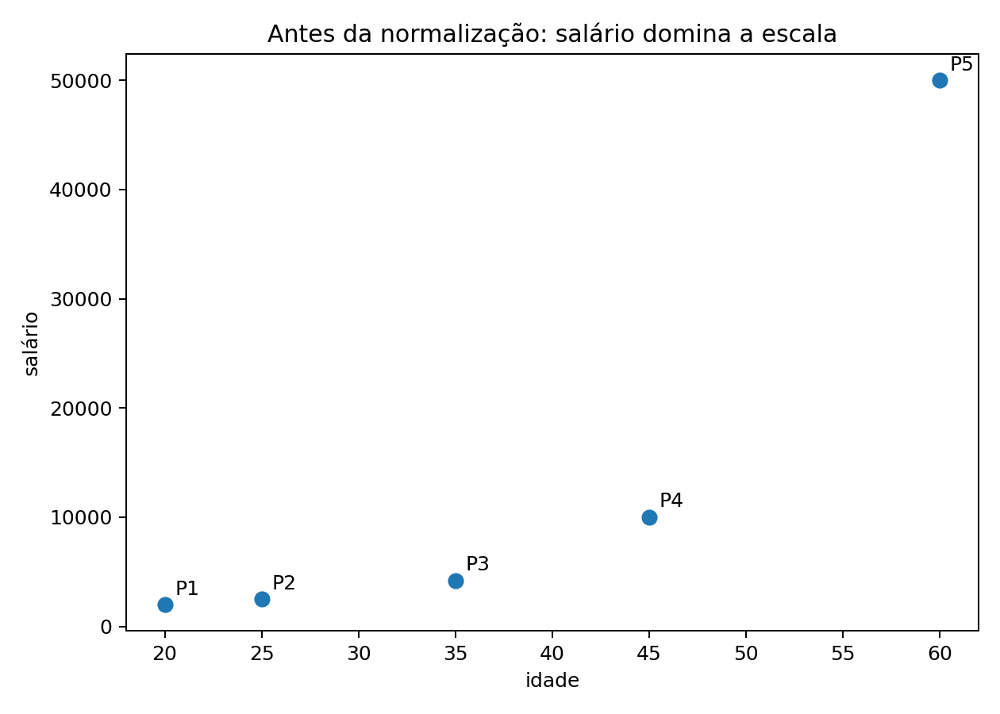

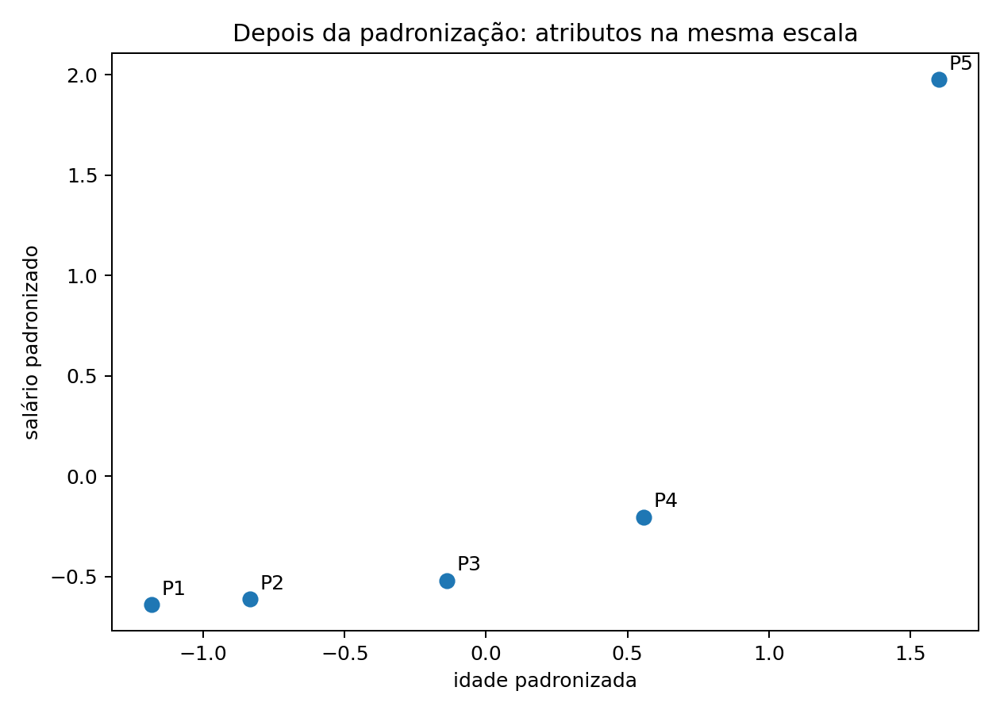

Resumo prático da aula:

> KNN sem normalização pode tratar como mais importante o atributo que tem maior magnitude numérica.

---

## 3.6 Maldição da dimensionalidade

O professor também destacou o problema da **maldição da dimensionalidade**.

A ideia é que, em dimensões muito altas, o espaço fica muito grande e esparso. Quando há milhares de atributos, as distâncias entre pontos podem se tornar pouco informativas: o vizinho mais próximo e o mais distante podem começar a parecer “quase igualmente distantes”.

Consequências para KNN:

- mais atributos aumentam muito a complexidade do espaço;
- a quantidade de dados necessária cresce rapidamente;
- o custo computacional aumenta;
- a noção de “vizinho mais próximo” pode perder força;
- pode ser necessário selecionar ou combinar atributos relevantes.

---

# 4. Seleção de hiperparâmetros no KNN

O principal hiperparâmetro do KNN é $K$.

O professor destacou o comportamento oposto entre valores pequenos e grandes de $K$:

| Valor de $K$ | Comportamento | Risco |
|---:|---|---|
| Muito pequeno | fronteira muito complexa | sensível a ruído |
| Muito grande | fronteira muito simples | inclui pontos distantes demais |
| Intermediário | equilíbrio | deve ser escolhido por validação |

## 4.1 Exemplo visual: $K = 1$, $K = 5$ e $K = 25$

Abaixo, um exemplo artificial inspirado na explicação do professor sobre regiões de decisão complexas e simples.

### $K = 1$

Com $K = 1$, a fronteira fica bastante sensível aos pontos individuais.

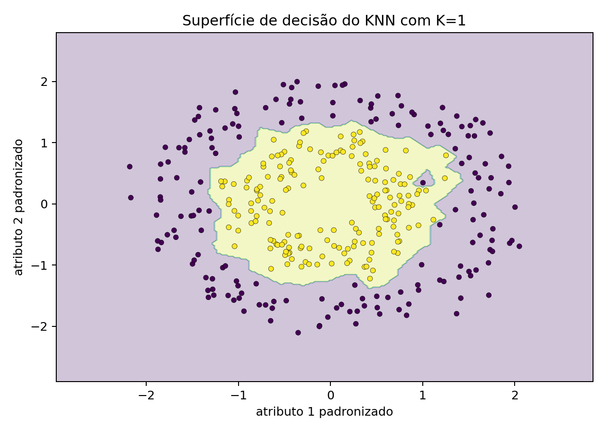

### $K = 5$

Com um valor intermediário, a fronteira tende a ser menos ruidosa e ainda flexível.

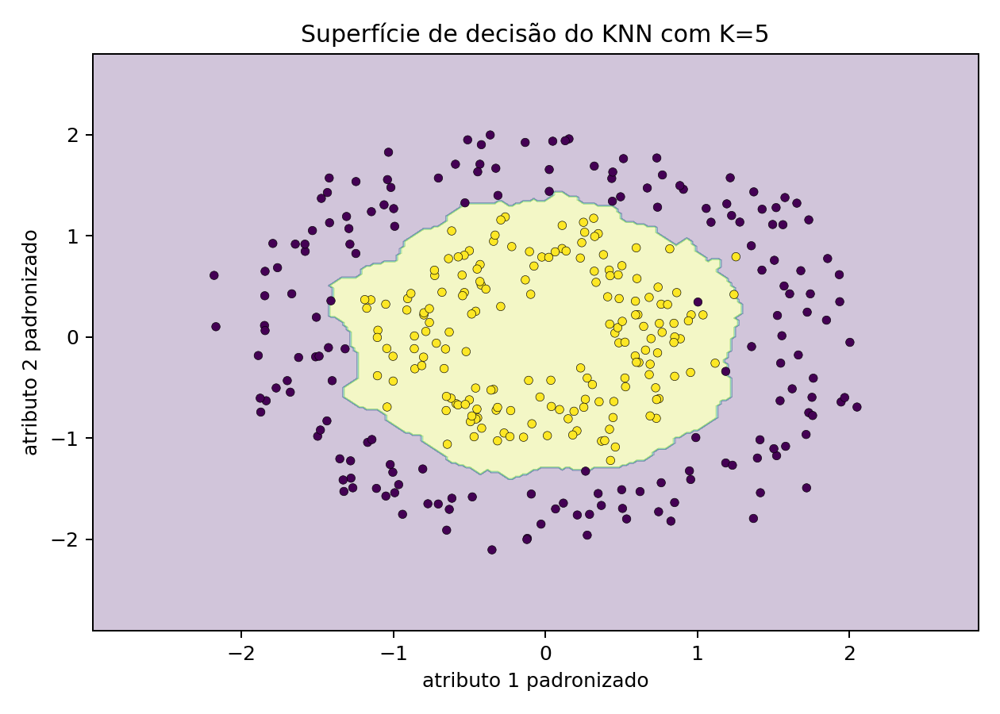

### $K = 25$

Com $K$ alto, a fronteira fica mais simples e pode perder detalhes importantes da estrutura dos dados.

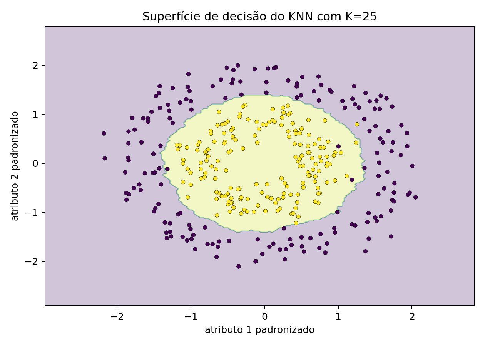

---

## 4.2 Grid Search para escolher $K$

A orientação da aula foi não deixar hiperparâmetros simplesmente no valor padrão da biblioteca. A escolha deve ser feita de maneira sistemática.

Para o KNN, o professor explicou o processo de Grid Search assim:

1. separar os dados em treino, validação e teste;
2. escolher valores candidatos para $K$;
3. treinar/avaliar o KNN para cada valor de $K$ usando treino e validação;
4. escolher o $K$ com menor erro de validação;
5. juntar treino e validação;
6. avaliar uma única vez no teste.

Representação:

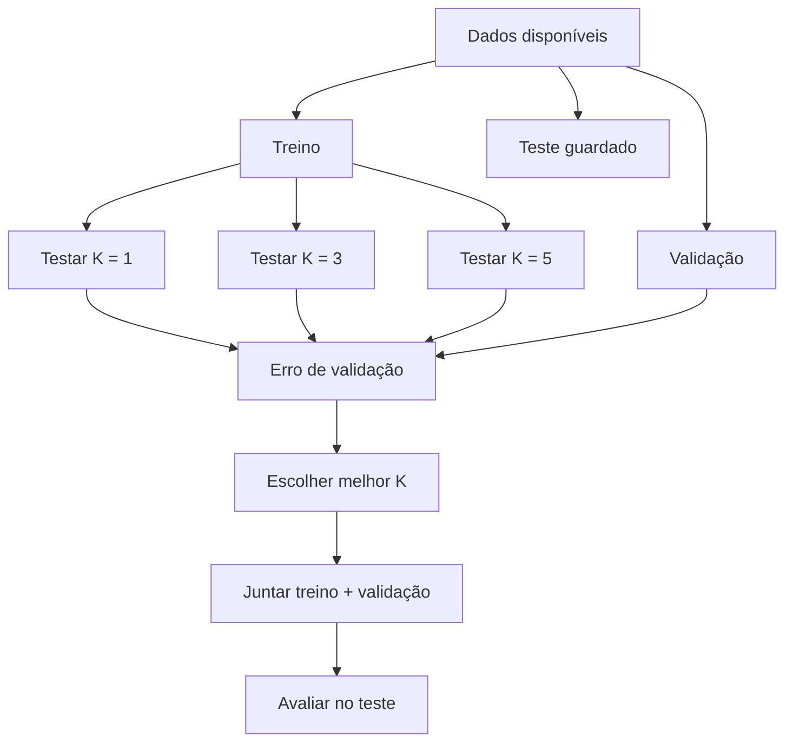

A metáfora usada em aula foi: o teste deve ficar “guardado na gaveta”; ele não deve participar da escolha do hiperparâmetro.

---

# 5. Árvores de decisão

Depois do KNN, a aula passou para **Árvores de Decisão**.

A analogia usada foi o jogo **Cara a Cara**: fazemos perguntas sucessivas para eliminar possibilidades e chegar a uma resposta.

Em uma árvore de decisão:

- nós internos verificam valores de atributos;
- cada ramo corresponde a uma resposta ou limiar;
- folhas armazenam uma saída;
- para classificação, a folha retorna uma classe;
- para regressão, a folha retorna uma média.

## 5.1 Exemplo: regras se-então

Com frutas, uma árvore poderia fazer perguntas como:

```text
largura > 6.5 cm?
├── sim: altura > 9.5 cm?
│   ├── sim: limão
│   └── não: laranja
└── não: altura > 6.0 cm?
    ├── sim: limão
    └── não: laranja
```

Em termos de fluxo:

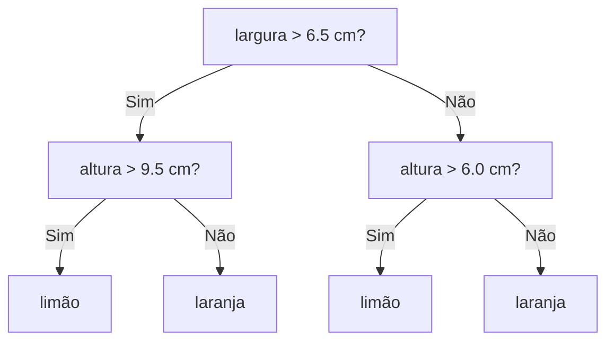

## 5.2 Predição usando uma árvore

Dada uma árvore já treinada e um padrão de teste:

1. começa na raiz;
2. verifica o atributo do nó atual;
3. compara com o limiar;
4. segue o ramo correspondente;
5. repete até chegar a uma folha;
6. retorna a saída da folha.

## 5.3 Saída da folha

Para classificação:

$$
\hat{y} = \text{classe mais comum na folha}
$$

Para regressão:

$$
\hat{y} = \text{média das saídas dos exemplos na folha}
$$

## 5.4 Partições do espaço

Cada caminho na árvore define uma região $R_k$ no espaço de entrada. Em dados contínuos, as árvores criam partições por limiares.

Exemplo visual:

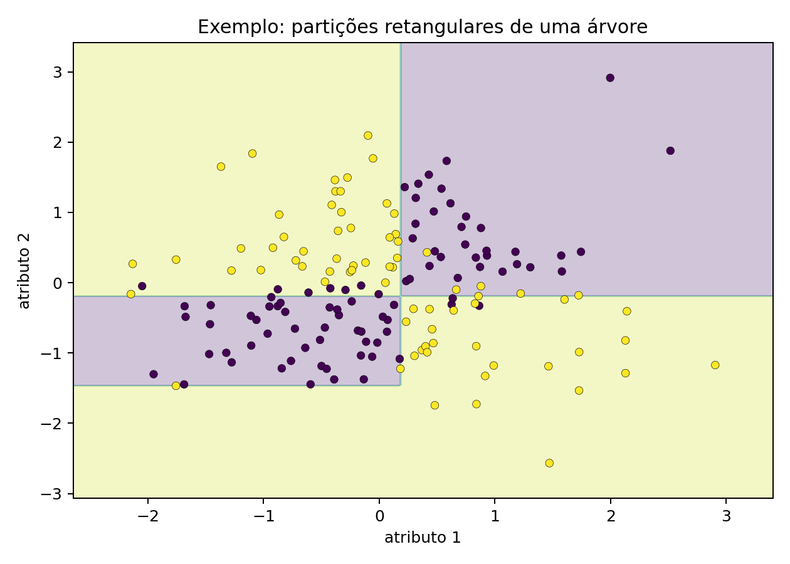

E uma árvore treinada simples:

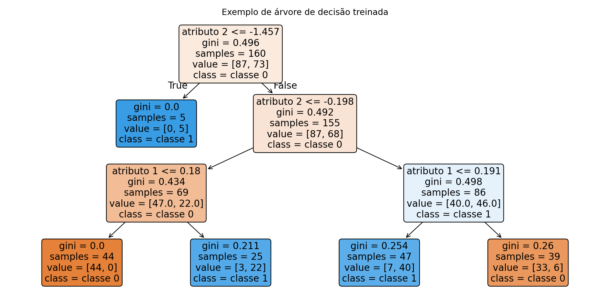

---

# 6. Entropia, Gini e ganho de pureza

A pergunta central para treinar uma árvore é:

> Como o algoritmo escolhe a melhor pergunta para fazer em cada nó?

A resposta da aula foi: ele usa uma medida de **impureza**.

A árvore tenta criar divisões que deixem os grupos resultantes mais puros.

---

## 6.1 Entropia

A entropia mede o grau de incerteza, surpresa ou bagunça de um conjunto.

Para classes $C_k$:

$$
H = -\sum_k P(C_k)\log_2 P(C_k)
$$

Intuição da aula:

- se uma cesta tem apenas limões, a entropia é baixa/zero;
- se uma cesta tem metade limões e metade laranjas, a entropia é alta;
- quanto mais misturadas as classes, maior a impureza.

---

## 6.2 Índice de Gini

O índice de Gini também mede impureza. Nos slides, ele aparece como:

$$
G = \sum_k P(C_k)(1 - P(C_k))
$$

Forma equivalente:

$$
G = 1 - \sum_k P(C_k)^2
$$

Intuição:

- Gini baixo: grupo mais puro;
- Gini alto: grupo mais misturado.

Comparação visual entre Entropia e Gini:

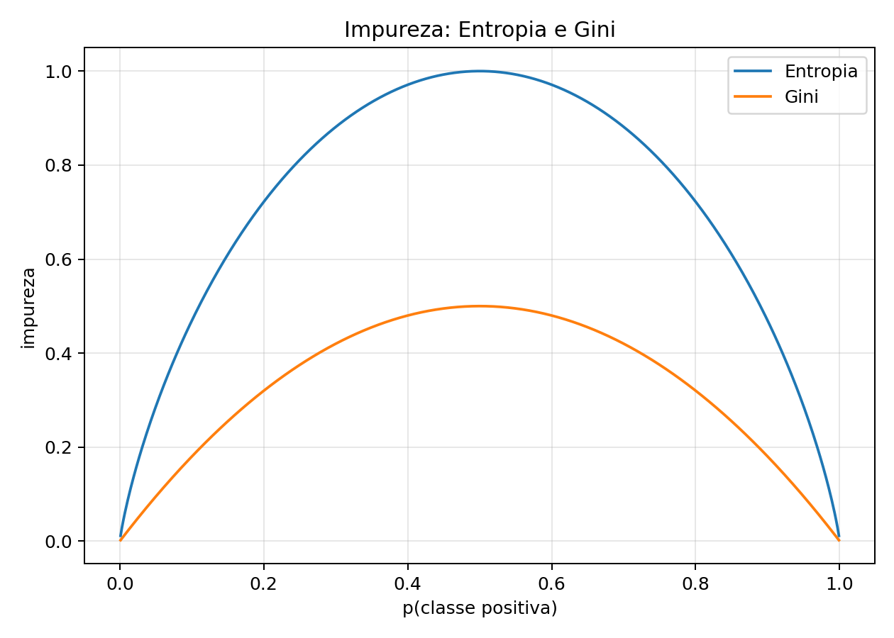

---

## 6.3 Ganho de informação / redução de impureza

A árvore escolhe a pergunta que mais reduz a impureza.

Se antes da divisão o nó era muito misturado e depois da divisão os filhos ficaram mais puros, a pergunta foi boa.

A impureza depois de uma divisão deve ser calculada ponderando os filhos pelo número de exemplos que caem em cada ramo.

Forma geral:

$$
I_{\text{após divisão}} = \sum_b \frac{N_b}{N} I_b
$$

em que:

- $b$ representa cada ramo/filho;
- $N_b$ é o número de exemplos no ramo $b$;
- $N$ é o total de exemplos no nó pai;
- $I_b$ é a impureza do ramo.

A redução de impureza é:

$$
\Delta I = I_{\text{pai}} - I_{\text{após divisão}}
$$

A árvore escolhe a divisão que maximiza essa redução.

---

## 6.4 Treinamento guloso

O treinamento de árvores é guloso (*greedy*):

1. começa com uma árvore vazia;
2. procura a melhor divisão no nó atual;
3. escolhe a melhor divisão naquele momento;
4. repete recursivamente para os filhos;
5. para quando chega a uma folha ou a algum critério de parada.

O professor destacou que a árvore testa perguntas candidatas e escolhe a que melhora mais a pureza naquele instante.

---

# 7. Overfitting, poda e observações sobre árvores

Um ponto importante dos slides é que sempre é possível criar uma árvore muito grande que separe perfeitamente os exemplos de treino. O problema é que isso pode causar **overfitting**.

## 7.1 Por que árvores podem sobreajustar?

Uma árvore muito profunda pode criar regras específicas demais, ajustando inclusive o ruído do treinamento.

Isso significa que ela pode:

- acertar muito no treino;
- errar mais em dados novos;
- generalizar mal.

## 7.2 Estratégias de controle

Duas ideias destacadas nos slides:

1. evitar árvores muito grandes, exigindo uma variação mínima de pureza para ramificar;
2. podar a árvore gerada usando conjunto de validação.

## 7.3 Algoritmos citados

| Algoritmo | Característica citada |
|---|---|
| ID3 | um dos primeiros algoritmos; normalmente usa entropia |
| C4.5 | extensão do ID3, com suporte a poda e dados contínuos/faltantes |
| CART | usado para classificação e regressão; normalmente usa Gini |

## 7.4 Vantagens e desvantagens

Vantagens:

- são interpretáveis;
- geram regras de decisão;
- são escaláveis;
- fazem seleção automática de atributos importantes;
- podem lidar com dados faltosos.

Desvantagens:

- tendência ao overfitting;
- pequenas variações nos dados podem gerar árvores diferentes.

## 7.5 Árvores como bases adaptativas

Nos slides, a árvore também aparece como um modelo de **bases adaptativas**:

$$
f(x) = \sum_{k=1}^{K} w_k I(x \in R_k)
$$

em que:

- $R_k$ é uma região/partição do espaço de entrada;
- $I(x \in R_k)$ é uma função indicadora;
- $w_k$ é a resposta associada à região.

Essa forma mostra que a árvore divide o espaço em regiões e associa uma resposta a cada região.

---

# 8. Avaliação de modelos: generalização, validação e K-fold

A aula também retomou a ideia de avaliação de modelos e seleção de hiperparâmetros.

## 8.1 Generalização

O conceito central é **generalização**: queremos que o modelo seja bom em dados que ainda não viu.

A ideia foi explicada com a imagem de que os pacientes antigos já foram atendidos; o modelo precisa ser bom para o paciente que chega amanhã.

Em aprendizado de máquina, não basta acertar o treino. Queremos estimar a capacidade de desempenho em dados novos.

## 8.2 Treino, validação e teste

Separação conceitual:

| Conjunto | Papel |
|---|---|
| Treino | ajustar parâmetros |
| Validação | escolher hiperparâmetros |
| Teste | estimar generalização final |

A validação foi comparada a um “simulado”. O teste, por sua vez, deve ser guardado para o final.

## 8.3 Grid Search

O Grid Search organiza a tentativa e erro de hiperparâmetros.

Exemplo:

```text
alpha ∈ {10^-4, 10^-3, 10^-2, 10^-1}
lambda ∈ {10^-4, 10^-3, 10^-2, 10^-1}
```

O algoritmo testa combinações e escolhe a melhor no conjunto de validação.

## 8.4 K-fold cross-validation

A validação cruzada de K partições divide os dados em $K$ partes. Em cada rodada, uma parte é usada como teste/validação e as demais como treino.

Processo:

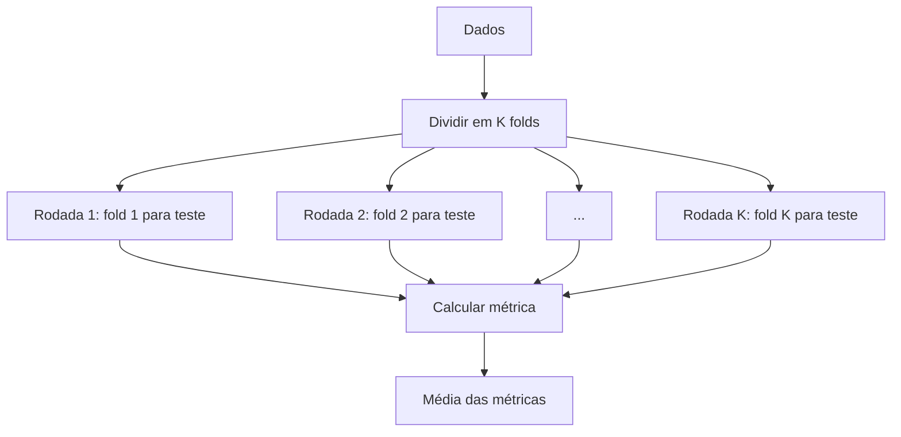

Vantagem destacada:

- todos os exemplos participam do teste em algum momento;
- a avaliação fica mais estável do que uma única divisão treino/teste.

Limitação:

- em bases muito grandes, pode ser caro demais rodar várias partições.

---

# 9. Redes neurais artificiais

A aula também introduziu Redes Neurais Artificiais.

Nos slides, o professor destaca que redes neurais são modelos “inspirados” em neurônios biológicos, mas não pretendem ser biologicamente plausíveis.

## 9.1 Perceptron

O Perceptron de Rosenblatt é apresentado como um modelo linear para classificação binária.

A predição é:

$$
\hat{y}_i = sign(w^\top x_i)
$$

com:

$$
sign(z) =
\begin{cases}
-1, & z < 0 \\
1, & z \ge 0
\end{cases}
$$

O vetor de entrada inclui o termo de viés:

$$
x_i = [1, x_1, x_2, \dots, x_D]^\top
$$

## 9.2 Ideia geométrica

A fronteira de decisão do Perceptron é dada por:

$$
w^\top x = 0
$$

O professor relaciona isso à geometria do produto interno: o sinal de $w^\top x$ indica de que lado da fronteira o ponto está.

## 9.3 Treinamento do Perceptron

O algoritmo apresentado nos slides segue esta estrutura:

1. inicializar os pesos $w(0)$;
2. repetir por várias épocas;
3. embaralhar os dados;
4. para cada exemplo:
   - calcular $\hat{y}_i$;
   - calcular o erro $e_i = y_i - \hat{y}_i$;
   - atualizar os pesos:

$$
w(t+1) = w(t) + \alpha e_i x_i
$$

em que $\alpha$ é o passo de aprendizagem.

## 9.4 ADALINE e MADALINE

Os slides também retomam modelos lineares neurais relacionados:

| Modelo | Ideia |
|---|---|
| Perceptron | usa ativação `sign` e regra de atualização baseada em erro de classificação |
| ADALINE | usa erro linear antes da função sinal, com custo quadrático |
| MADALINE | extensão com múltiplas unidades ADALINE |

## 9.5 MLP — Perceptron Multicamadas

O MLP possui uma ou mais camadas ocultas. Diferente dos modelos lineares, ele usa ativações não lineares nas camadas ocultas e consegue resolver problemas não lineares.

Esquema:

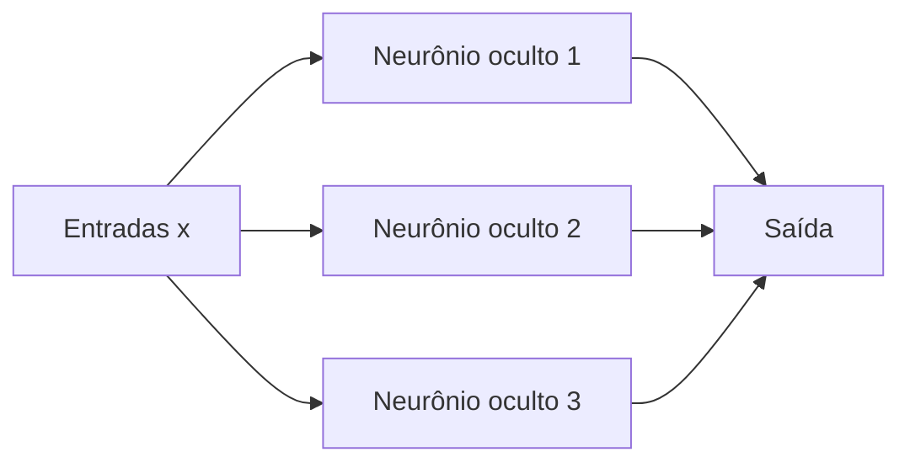

## 9.6 Funções de ativação

Função de ativação é a função aplicada à saída de um neurônio:

$$
\phi(w^\top x_i)
$$

As funções citadas nos slides:

### Sigmoide

$$
\sigma(z) = \frac{1}{1 + e^{-z}}
$$

### Tangente hiperbólica

$$
tanh(z) = \frac{e^{2z} - 1}{e^{2z} + 1}
$$

### ReLU

$$
relu(z) = \max(0, z)
$$

Visualmente:

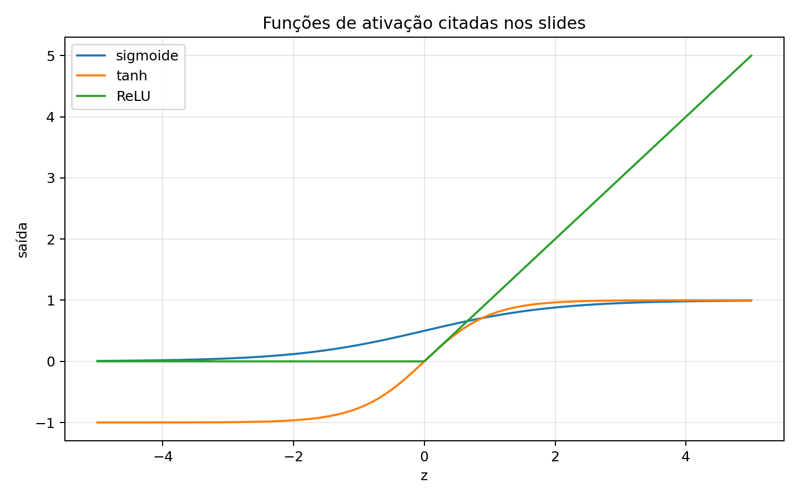

## 9.7 Backpropagation

Nos slides, a motivação aparece como uma pergunta:

> Como treinar os pesos de uma rede MLP?

O problema é que não há uma “saída desejada” diretamente para os neurônios ocultos. A ideia então é:

1. escrever uma função custo;
2. computar seus gradientes;
3. caminhar na direção contrária ao gradiente;
4. usar o algoritmo de backpropagation para propagar o erro e calcular gradientes nas camadas internas.

Assim, o backpropagation entra como o mecanismo que permite treinar redes com camadas ocultas.

## 9.8 Técnicas de treinamento citadas

Nos slides de redes neurais aparecem recomendações práticas como:

- usar termo de momentum;
- inicializar pesos cuidadosamente;
- em caso de overfitting, usar *weight decay* e/ou *early stopping*;
- selecionar hiperparâmetros via *random search*.

---

# 10. SVM — Máquinas de Vetores de Suporte

A parte de SVM trabalha com classificação binária, normalmente com classes $-1$ e $1$.

A ideia geral é escolher uma fronteira que separe as classes com **maior margem**.

## 10.1 Problema inicial

Uma fronteira linear pode ser escrita como:

$$
w^\top x_i + b = 0
$$

A classificação pode ser vista pelo sinal:

$$
\hat{y}_i = sign(w^\top x_i + b)
$$

## 10.2 Ideia da margem máxima

O professor/slides destacam que a fronteira otimizada pode ficar próxima demais de uma das classes. O SVM tenta evitar isso focando nos exemplos próximos da região de separação.

Esses exemplos próximos são chamados de **vetores suporte**.

Eles são importantes porque definem a fronteira.

## 10.3 Hard margin

No caso linear separável, o SVM busca uma margem máxima com a restrição:

$$
(w^\top x_i + b)y_i \geq 1
$$

A margem entre os hiperplanos é:

$$
M = \frac{2}{\|w\|}
$$

Maximizar a margem equivale a minimizar $\|w\|$.

A formulação primal aparece como:

$$
\min_{w,b} \frac{1}{2}\|w\|^2
$$

sujeito a:

$$
(w^\top x_i + b)y_i \geq 1, \quad \forall i
$$

Exemplo visual:

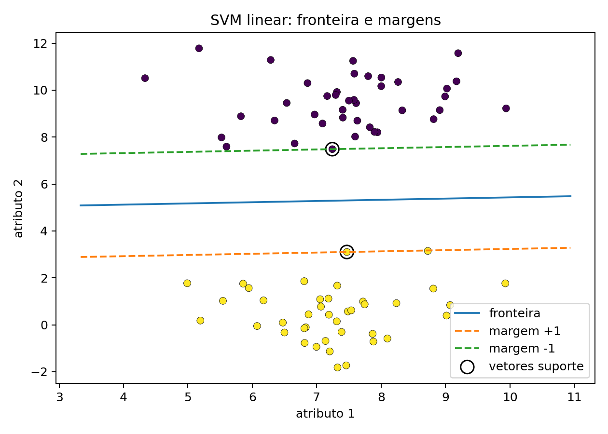

## 10.4 Vetores suporte

Na formulação dual, somente alguns coeficientes $\alpha_i$ são diferentes de zero. Esses pontos são justamente os vetores suporte.

A predição pode ser escrita usando produto interno com os vetores suporte:

$$
\hat{y}_j = sign\left(b^* + \sum_{i \in S}\alpha_i y_i x_i^\top x_j\right)
$$

Isso é importante porque prepara a ideia de kernel.

## 10.5 Soft margin

Quando os dados não são perfeitamente separáveis, usa-se a formulação com variáveis de folga $\xi_i$.

A formulação apresentada nos slides é:

$$
\min_{w,b} \frac{1}{2}\|w\|^2 + C\sum_{i=1}^{N}\xi_i
$$

sujeito a:

$$
(w^\top x_i + b)y_i \geq 1 - \xi_i
$$

$$
\xi_i \geq 0
$$

Interpretação:

- $\xi_i$ mede violação da margem;
- se $\xi_i > 1$, o padrão é classificado de forma errada;
- $C$ controla o compromisso entre margem larga e erro de classificação.

Segundo os slides:

| Valor de $C$ | Efeito |
|---:|---|
| $C \to 0$ | margem maior, mais exemplos podem errar |
| $C \to \infty$ | tenta classificar mais corretamente, mas margem menor |

## 10.6 SVM não linear e kernel

A pergunta seguinte é:

> Como transformar um classificador linear em não linear?

A ideia apresentada é criar novos atributos com uma transformação não linear $\phi(x)$.

Exemplo:

$$
x = [x_1, x_2]^\top
$$

$$
\phi(x) = [x_1, x_2, x_1^2, x_2^2]^\top
$$

O kernel permite trabalhar com produtos internos nesse espaço transformado sem necessariamente construir explicitamente todos os novos atributos.

---

# 11. Mapa mental da aula

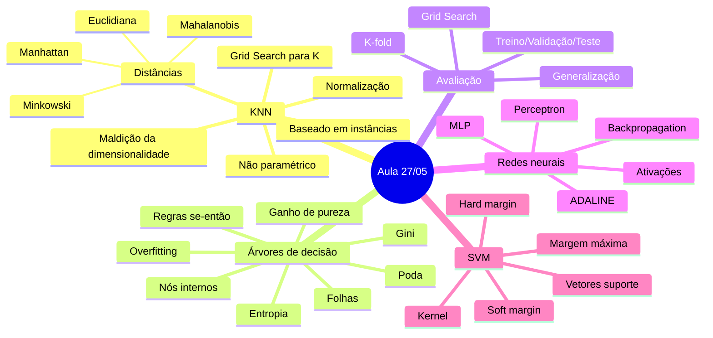

---

# 12. Resumo final

## Ideias que mais se repetem na aula

1. **Não basta treinar; é preciso generalizar.**
   O modelo deve funcionar bem em dados que ainda não viu.

2. **KNN é simples, mas não é fraco.**
   Ele é um modelo baseado em instâncias e depende fortemente da escolha de $K$, da métrica de distância e da normalização.

3. **Hiperparâmetros não devem ser deixados no padrão sem análise.**
   O professor enfatizou o uso de Grid Search como ferramenta prática e sistemática.

4. **Árvores são interpretáveis, mas podem sobreajustar.**
   A capacidade de criar regras se-então é uma vantagem, mas árvores muito grandes podem memorizar ruído.

5. **Entropia e Gini medem impureza.**
   A árvore escolhe divisões que reduzem a bagunça dos dados.

6. **Redes neurais começam com modelos lineares e evoluem para MLPs.**
   A não linearidade vem das funções de ativação e das camadas ocultas.

7. **Backpropagation permite treinar redes com camadas ocultas.**
   Ele calcula gradientes da função custo em relação aos pesos internos.

8. **SVM busca uma fronteira com margem máxima.**
   Os vetores suporte são os pontos próximos da fronteira que definem a separação.

---

## Checklist de estudo

- [ ] Sei explicar a diferença entre modelo paramétrico e não paramétrico.
- [ ] Sei por que o KNN precisa armazenar os dados de treino.
- [ ] Sei explicar o papel do hiperparâmetro $K$.
- [ ] Sei por que normalização é essencial no KNN.
- [ ] Sei calcular a ideia básica de distância Euclidiana e Manhattan.
- [ ] Sei explicar a maldição da dimensionalidade.
- [ ] Sei descrever como uma árvore de decisão faz predição.
- [ ] Sei explicar entropia e Gini como medidas de impureza.
- [ ] Sei por que árvores profundas podem causar overfitting.
- [ ] Sei diferenciar treino, validação e teste.
- [ ] Sei explicar a ideia de K-fold cross-validation.
- [ ] Sei descrever o Perceptron como classificador linear.
- [ ] Sei explicar o papel das funções de ativação em MLPs.
- [ ] Sei explicar a ideia geral do backpropagation.
- [ ] Sei explicar margem máxima e vetores suporte em SVM.

---

## Mini-glossário da aula

| Termo | Significado no contexto da aula |
|---|---|
| Parâmetro | Valor ajustado pelo modelo durante o treinamento |
| Hiperparâmetro | Valor escolhido antes/do processo de treinamento para controlar o comportamento do modelo |
| KNN | Modelo baseado nos $K$ vizinhos mais próximos |
| Métrica de distância | Função usada para medir proximidade entre amostras |
| Normalização | Ajuste de escala dos atributos |
| Maldição da dimensionalidade | Dificuldade causada por espaços de alta dimensão |
| Entropia | Medida de impureza/incerteza de um conjunto |
| Gini | Medida de impureza usada em árvores |
| Poda | Redução de uma árvore para evitar overfitting |
| Validação | Conjunto usado para escolher hiperparâmetros |
| Teste | Conjunto usado para estimar generalização final |
| Perceptron | Modelo neural linear para classificação binária |
| MLP | Rede neural com camadas ocultas |
| Backpropagation | Algoritmo para calcular gradientes em redes neurais |
| SVM | Classificador que busca máxima margem |
| Vetores suporte | Amostras próximas da fronteira que definem a margem |
| Kernel | Forma de usar produtos internos em espaços transformados |
