# Aula 29/05 — Comitês, Agrupamento, PCA e Projetos de Aprendizado de Máquina

> **Disciplina:** Aprendizado de Máquina  
> **Professor:** César Lincoln Cavalcante Mattos  
> **Contexto:** última aula do módulo, fechando os conteúdos supervisionados, entrando em aprendizado não-supervisionado e finalizando com uma conversa sobre projetos reais de ML.


---

## Sumário

1. [Panorama da aula](#1-panorama-da-aula)
2. [Comitês de modelos](#2-comitês-de-modelos)
3. [Bagging](#3-bagging)
4. [Random Forest](#4-random-forest)
5. [Boosting](#5-boosting)
6. [AdaBoost](#6-adaboost)
7. [Gradient Boosting](#7-gradient-boosting)
8. [Aprendizado não-supervisionado](#8-aprendizado-não-supervisionado)
9. [Agrupamento hierárquico aglomerativo](#9-agrupamento-hierárquico-aglomerativo)
10. [K-Means](#10-k-means)
11. [Limitações do K-Means e GMM](#11-limitações-do-k-means-e-gmm)
12. [Seleção e combinação de atributos](#12-seleção-e-combinação-de-atributos)
13. [PCA](#13-pca)
14. [Projeto de sistemas de aprendizado de máquina](#14-projeto-de-sistemas-de-aprendizado-de-máquina)
15. [MLOps e desafios reais](#15-mlops-e-desafios-reais)
16. [Conexão com a Lista 03](#16-conexão-com-a-lista-03)
17. [Resumo final](#17-resumo-final)

---

## 1. Panorama da aula

A aula do dia 29/05 foi organizada em quatro blocos principais:

1. **Comitês de modelos**: combinação de modelos preditivos.
2. **Aprendizado não-supervisionado — agrupamento**: especialmente agrupamento hierárquico e K-Means.
3. **Redução de dimensionalidade — PCA**.
4. **Projetos de aprendizado de máquina**: desafios reais, reprodutibilidade, MLOps e débito técnico.

Uma frase central da aula foi a diferença entre aprender algoritmos e construir projetos reais:

> Os modelos, algoritmos e cálculos são difíceis, mas o projeto é ainda mais desafiador.

---

## 2. Comitês de modelos

### 2.1. Motivação

A ideia de **comitês de modelos**, ou **ensembles**, é combinar predições de diferentes modelos para resolver uma tarefa.

A motivação vem de uma dificuldade prática: depois de estudar vários modelos de aprendizado de máquina, nem sempre é trivial saber qual deles usar. Modelos diferentes possuem premissas, limitações, vantagens e desvantagens. Além disso, em uma mesma tarefa, modelos diferentes podem ter desempenhos parecidos.

Em vez de escolher somente um modelo, pode ser vantajoso combinar vários.

A analogia usada em aula foi a de uma equipe humana. Para resolver um problema difícil, não faz sentido juntar cinco pessoas exatamente iguais, com a mesma expertise. É melhor juntar pessoas com competências complementares, como alguém forte em BI, alguém forte em engenharia de dados e alguém forte em estatística.

No caso dos modelos:

- modelos diferentes podem acertar casos diferentes;
- modelos diferentes podem errar casos diferentes;
- a combinação pode compensar fraquezas individuais;
- o objetivo é melhorar a capacidade de generalização.

### 2.2. No Free Lunch

O professor também conectou essa ideia ao teorema do **No Free Lunch**. A intuição é que não existe um método que seja superior a todos os outros em todos os problemas.

Por isso, combinar modelos pode ser uma estratégia pragmática: em vez de apostar tudo em uma única hipótese, usamos várias hipóteses e agregamos suas respostas.

### 2.3. Dilema viés-variância

Os slides apresentam o dilema **viés-variância** como uma motivação para comitês.

- **Viés alto** costuma estar associado a **underfitting**: o modelo é simples demais.
- **Variância alta** costuma estar associada a **overfitting**: o modelo se ajusta demais ao treino.

Comitês podem ajudar a controlar viés ou variância, dependendo da estratégia usada.

A decomposição clássica do erro quadrático médio de um estimador é:

```math
\mathbb{E}\left[(\hat{\theta} - \theta^*)^2\right]
= \mathbb{E}\left[(\hat{\theta} - \bar{\theta})^2\right]
+ (\bar{\theta} - \theta^*)^2
```

Em que:

- o primeiro termo representa a **variância** do estimador;
- o segundo termo representa o **viés** ao quadrado.

A mensagem importante é que, às vezes, um estimador com um pouco mais de viés pode reduzir bastante a variância, melhorando o erro final.

### 2.4. Três argumentos de Dietterich

O professor usou a figura clássica de Thomas Dietterich sobre ensembles. A ideia é justificar por que combinar modelos pode ajudar.

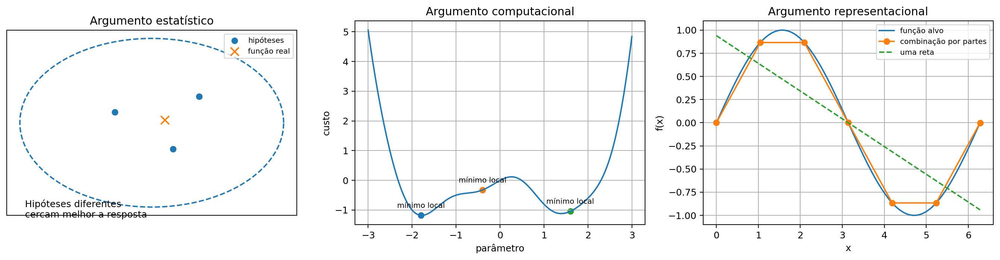

#### 2.4.1. Argumento estatístico

Quando escolhemos um modelo, escolhemos hipóteses sobre os dados. Por exemplo:

- ruído gaussiano;
- dados Bernoulli;
- comportamento linear;
- comportamento polinomial;
- distribuição categórica.

Essas hipóteses podem estar erradas. Mas, quando usamos hipóteses diferentes para o mesmo problema, elas podem cercar melhor a resposta verdadeira, mesmo que nenhuma delas esteja perfeitamente correta.

#### 2.4.2. Argumento computacional

Muitos modelos dependem de otimização. Em modelos complexos, a otimização pode ser **não convexa**, sem garantia de atingir o ótimo global.

Treinar múltiplos modelos pode fazer com que cada um chegue a regiões diferentes do espaço de soluções. A combinação dessas soluções pode ser mais robusta do que depender de uma única execução.

#### 2.4.3. Argumento representacional

Alguns modelos são limitados em termos de representação. Uma regressão linear, por exemplo, traça retas, planos ou hiperplanos. Ela não representa diretamente uma função altamente não linear.

Mas uma combinação de modelos simples pode ter comportamento final não linear. Como o professor comentou, não dá para aproximar bem uma senoide com uma única reta, mas é possível aproximá-la melhor com várias retas por partes.

---

## 2.5. Condições para um bom comitê

O professor destacou duas condições principais:

### 1. Os modelos precisam ser minimamente bons

Juntar vários modelos que são tão ruins quanto chute aleatório não resolve o problema. Antes de formar um comitê, cada modelo precisa ser razoável.

Isso exige:

- treinamento cuidadoso;
- ajuste de hiperparâmetros;
- avaliação adequada;
- controle de overfitting e underfitting.

### 2. Os modelos precisam ser diversos

A diversidade é essencial. O professor usou a analogia dos “cinco Michaels”: cinco pessoas com a mesma expertise não resolvem muito mais do que uma pessoa só.

Em comitês, a diversidade significa que:

- os modelos não devem cometer exatamente os mesmos erros;
- quando um modelo erra, outros devem ter chance de corrigir;
- a discordância controlada é útil.

---

## 2.6. Como um comitê faz predição?

### Classificação

Em problemas de classificação, há duas estratégias comuns:

1. **Votação majoritária**: escolhe a classe mais votada pelos modelos.
2. **Média das probabilidades**: se os modelos retornam probabilidades, calcula-se a média das probabilidades por classe.

Exemplo simples de votação:

```python
predicoes = ["bus", "van", "bus", "bus", "opel"]
classe_final = max(set(predicoes), key=predicoes.count)
print(classe_final)  # bus
```

### Regressão

Em regressão, o comitê geralmente tira a média das predições individuais:

```python
predicoes = [10.5, 11.2, 10.9, 12.0]
predicao_final = sum(predicoes) / len(predicoes)
print(predicao_final)
```

Também é possível usar uma **média ponderada**, atribuindo pesos maiores a modelos que tiveram melhor desempenho em validação.

### Votação majoritária e independência dos erros

Os slides mostram que, em um problema binário, se os erros dos classificadores fossem independentes e cada classificador tivesse taxa de erro individual `epsilon`, a probabilidade de erro do comitê seria:

```math
\sum_{k=\lfloor M/2 \rfloor + 1}^{M}
\binom{M}{k} \epsilon^k (1 - \epsilon)^{M-k}
```

A figura abaixo ilustra a ideia: se os classificadores individuais são melhores que o acaso e possuem erros diversos, aumentar o número de membros pode reduzir a probabilidade do comitê errar.

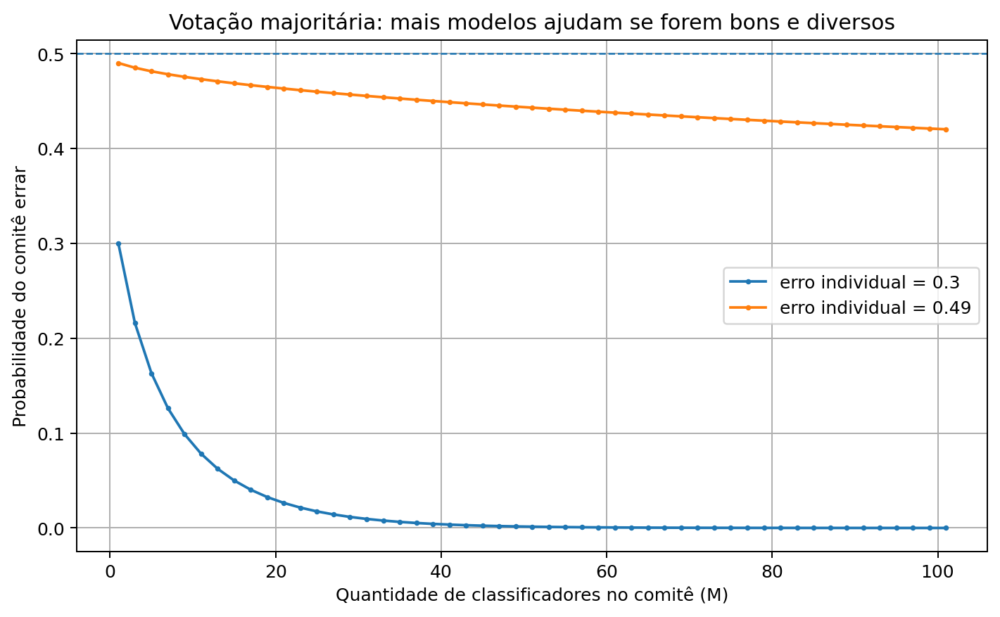

Na prática, porém, é difícil garantir independência completa entre os erros. Por isso entram estratégias como **bagging** e **boosting**, que tentam promover diversidade de forma ativa.

---

## 3. Bagging

### 3.1. Ideia geral

**Bagging** significa **Bootstrap Aggregating**.

A analogia usada pelo professor foi a de uma equipe estudando para uma prova com vários livros. Em vez de todo mundo estudar exatamente os mesmos livros, cada pessoa recebe uma amostra de materiais. Alguns livros se repetem entre pessoas, outros ficam exclusivos de alguém.

No aprendizado de máquina:

- o “material de estudo” é o conjunto de treinamento;
- cada modelo recebe uma amostra diferente dos dados;
- essas diferenças promovem diversidade;
- as predições são combinadas no final.

### 3.2. Bootstrap

O bagging cria `L` subconjuntos a partir do conjunto de treino original por **amostragem com reposição**.

Se temos `N` exemplos, cada modelo recebe uma amostra de tamanho `N`, mas com reposição. Isso significa que:

- alguns exemplos aparecem mais de uma vez;
- alguns exemplos não aparecem;
- aproximadamente `63,2%` dos exemplos são únicos em cada amostra para `N` grande;
- cerca de `1/3` fica fora daquela amostra, formando os exemplos **out-of-bag**.

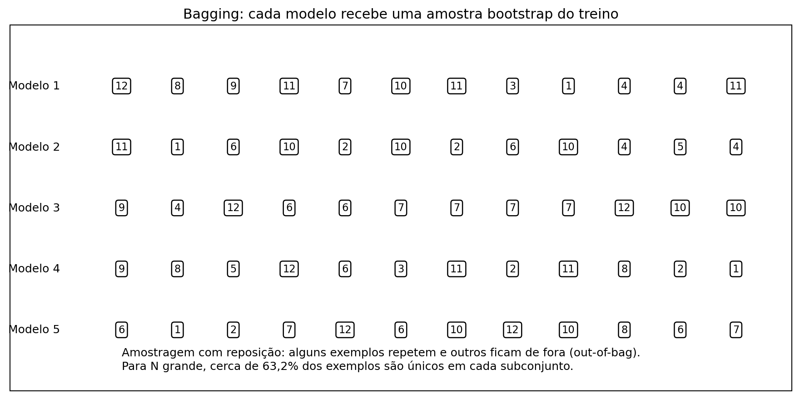

### 3.3. Vantagem computacional

Um ponto reforçado pelo professor foi que o bagging é naturalmente paralelo.

Cada modelo recebe seu subconjunto de treino e pode ser treinado independentemente. Isso torna fácil:

- treinar modelos em paralelo;
- adicionar novos membros ao comitê;
- aumentar o tamanho do ensemble sem recomeçar tudo do zero.

### 3.4. Bagging reduz variância

Nos slides, o bagging aparece como uma técnica de **redução de variância**. Como cada modelo vê uma versão diferente do treino, a média ou votação final tende a ficar menos instável do que um único modelo altamente variável.

Em compensação, cada modelo base pode ter um pouco mais de viés, porque vê menos exemplos únicos.

### 3.5. Exemplo com scikit-learn

```python
from sklearn.ensemble import BaggingClassifier
from sklearn.neighbors import KNeighborsClassifier

modelo = BaggingClassifier(
    estimator=KNeighborsClassifier(n_neighbors=3),
    n_estimators=20,
    bootstrap=True,
    random_state=42,
    n_jobs=-1,
)

modelo.fit(X_train, y_train)
y_pred = modelo.predict(X_test)
```

O professor mostrou um exemplo de bagging com `3-NN`: conforme o número de membros aumenta, o erro de teste pode cair. Mas isso vem com custo computacional maior.

---

## 4. Random Forest

### 4.1. O que é Random Forest?

**Random Forest** é um caso clássico de bagging usando **árvores de decisão**.

Além de amostrar exemplos com reposição, o Random Forest também amostra atributos. O professor comparou isso a sortear não apenas os livros que cada pessoa vai estudar, mas também os capítulos.

Isso aumenta ainda mais a diversidade das árvores.

### 4.2. Por que árvores?

Árvores de decisão são baratas de treinar e variam bastante dependendo dos dados. Essa sensibilidade, que em uma árvore isolada pode ser um problema, ajuda no ensemble porque gera diversidade.

### 4.3. Trade-off: desempenho versus interpretabilidade

Uma árvore isolada é interpretável. Dá para desenhar a árvore e explicar o caminho da decisão.

Mas uma floresta com dezenas ou centenas de árvores perde essa interpretabilidade direta. O professor destacou esse trade-off:

- ganha-se desempenho e estabilidade;
- perde-se explicabilidade simples.

### 4.4. Número de árvores não deve ser escolhido “no olho”

O professor comentou que aumentar o número de árvores pode melhorar o teste até certo ponto, mas não garante melhoria infinita. Pode haver aumento de custo e, em algumas situações, piora.

A escolha deve ser feita com validação ou `grid search`.

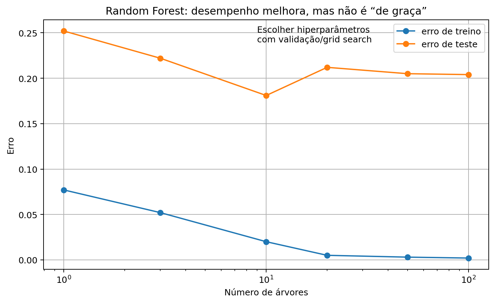

### 4.5. Exemplo com scikit-learn

```python
from sklearn.ensemble import RandomForestClassifier
from sklearn.model_selection import GridSearchCV

modelo = RandomForestClassifier(random_state=42, n_jobs=-1)

param_grid = {
    "n_estimators": [100, 200, 300],
    "max_depth": [None, 5, 10, 20],
    "min_samples_leaf": [1, 2, 5],
    "max_features": ["sqrt", None],
}

busca = GridSearchCV(
    estimator=modelo,
    param_grid=param_grid,
    scoring="f1_macro",
    cv=5,
    n_jobs=-1,
)

busca.fit(X_train, y_train)
print(busca.best_params_)
```

---

## 5. Boosting

### 5.1. Ideia geral

O professor apresentou o boosting usando a analogia de uma prova feita em sequência.

A primeira pessoa resolve a prova inteira e marca com asterisco as questões em que teve dificuldade. A segunda pessoa resolve a prova dando mais atenção aos asteriscos da primeira. Depois marca suas próprias dificuldades. A terceira foca nas dificuldades da segunda, e assim por diante.

Em aprendizado de máquina:

- modelos são treinados em sequência;
- cada modelo foca mais nos erros dos anteriores;
- o objetivo é intensificar o desempenho coletivo;
- a diversidade surge dos diferentes focos de cada modelo.

### 5.2. Diferença em relação ao bagging

| Aspecto | Bagging | Boosting |
|---|---|---|
| Treinamento | Paralelo | Sequencial |
| Foco | Reduzir variância | Reduzir viés de forma incremental |
| Diversidade | Amostras bootstrap | Pesos/resíduos dos erros anteriores |
| Modelo comum | Árvores de decisão | Árvores pequenas ou decision stumps |
| Custo | Mais fácil de paralelizar | Mais difícil de paralelizar |

### 5.3. Weak learners

O boosting costuma usar modelos simples, chamados de **weak learners**.

Um exemplo citado foi o **decision stump**, uma árvore de decisão com apenas um nível. Na prática, é um `if/else` treinado:

```text
se atributo_j <= limiar:
    classe A
senão:
    classe B
```

Apesar de simples, vários decision stumps combinados podem formar uma fronteira de decisão não linear.

---

## 6. AdaBoost

### 6.1. Intuição visual

O professor explicou o AdaBoost visualmente.

Imagine uma classificação binária com sinais de `+` e `-`. Um primeiro decision stump traça uma linha simples e erra alguns pontos. Os pontos errados recebem peso maior. O próximo modelo passa a se concentrar mais nesses pontos. O processo se repete.

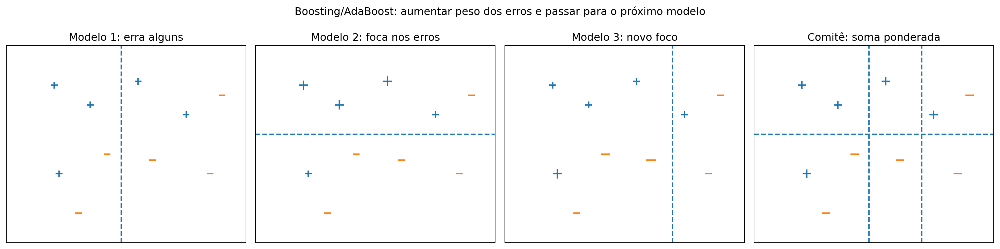

A lógica é:

1. treinar um modelo simples;
2. identificar os exemplos errados;
3. aumentar o peso dos erros;
4. diminuir o peso dos acertos;
5. treinar o próximo modelo com esses novos pesos;
6. combinar os modelos em uma soma ponderada.

### 6.2. Fórmula geral do AdaBoost

Os slides apresentam a versão para `y_i ∈ {-1, 1}`.

Inicialização dos pesos:

```math
\beta_i = \frac{1}{N}
```

Erro ponderado do classificador `G_m`:

```math
e_m = \frac{\sum_i \beta_i I(y_i \neq G_m(x_i))}{\sum_i \beta_i}
```

Peso do classificador:

```math
\alpha_m = \frac{1}{2}\log\left(\frac{1-e_m}{e_m}\right)
```

Atualização dos pesos dos exemplos:

```math
\beta_i \leftarrow \beta_i \exp(-y_i \alpha_m G_m(x_i))
```

Saída final:

```math
f(x) = \text{sign}\left(\sum_m \alpha_m G_m(x)\right)
```

O professor não focou na derivação completa, mas na intuição: **aumentar a importância do que foi errado e passar a dificuldade para o próximo modelo**.

### 6.3. Cuidado com overfitting

Boosting é forte, mas não é mágico. Se aumentarmos demais o número de modelos, a fronteira pode ficar complexa demais e o erro de teste pode piorar.

Por isso, novamente, os hiperparâmetros devem ser escolhidos com validação.

---

## 7. Gradient Boosting

### 7.1. Ideia geral

O professor disse que o Gradient Boosting é mais difícil de explicar formalmente, mas muito importante na prática, especialmente para **dados tabulares**.

A explicação foi feita usando regressão.

Suponha que o valor correto seja `y`, mas o primeiro modelo prevê um valor distante. A diferença entre o valor correto e a predição é o **resíduo**.

A ideia do Gradient Boosting é treinar o próximo modelo para predizer o resíduo do modelo anterior.

Se:

```math
y = f_1(x) + \epsilon_1
```

então, se um segundo modelo aprende `epsilon_1`, podemos somá-lo ao primeiro e chegar mais perto de `y`.

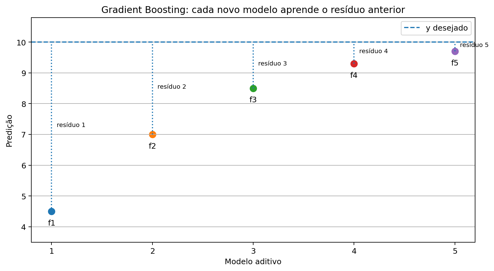

### 7.2. Pseudo-resíduos

Nos slides, o Gradient Boosting é apresentado como um processo aditivo:

```math
f_M(x) = f_0(x) + \sum_{m=1}^{M} \gamma_m G_m(x)
```

Cada novo modelo é treinado a partir dos pseudo-resíduos anteriores.

Para erro quadrático médio:

```math
J_{MSE}(y_i, f_{m-1}(x_i)) = \frac{1}{2}(y_i - f_{m-1}(x_i))^2
```

O pseudo-resíduo fica:

```math
r_{im} = y_i - f_{m-1}(x_i)
```

Ou seja, nesse caso, o novo modelo tenta aprender exatamente o erro que ficou faltando.

### 7.3. Implementações práticas

O professor citou três implementações muito usadas:

- **XGBoost**;
- **LightGBM**;
- **CatBoost**.

A explicação dada foi:

- **XGBoost**: implementação eficiente de Gradient Boosting, com foco em desempenho.
- **LightGBM**: implementação leve, com foco em memória e velocidade.
- **CatBoost**: muito bom para dados categóricos, com heurísticas próprias para esse tipo de dado.

### 7.4. Exemplo com scikit-learn

```python
from sklearn.ensemble import GradientBoostingClassifier
from sklearn.model_selection import GridSearchCV

modelo = GradientBoostingClassifier(random_state=42)

param_grid = {
    "n_estimators": [50, 100, 200],
    "learning_rate": [0.05, 0.1],
    "max_depth": [1, 3],
    "subsample": [0.8, 1.0],
}

busca = GridSearchCV(
    estimator=modelo,
    param_grid=param_grid,
    scoring="f1_macro",
    cv=5,
)

busca.fit(X_train, y_train)
print(busca.best_params_)
```

---

## 8. Aprendizado não-supervisionado

Depois de comitês, o professor encerrou a parte de aprendizado supervisionado e entrou em aprendizado não-supervisionado.

A diferença central é:

- **supervisionado**: temos pares `(X, y)` observados;
- **não-supervisionado**: temos apenas os dados `X`, sem saída observada.

No supervisionado, queremos aprender uma função:

```math
f: X \rightarrow y
```

No não-supervisionado, queremos descobrir estruturas nos dados.

### 8.1. Exemplos de tarefas não-supervisionadas

- agrupamento de dados;
- redução de dimensionalidade;
- modelagem de densidade de probabilidade;
- descoberta de causas ocultas ou variáveis latentes.

### 8.2. Exemplos de aplicações

- compressão de dados;
- detecção de anomalias ou outliers;
- visualização de dados;
- auxílio a outros algoritmos;
- sistemas de recomendação;
- geração de dados.

O professor deu o exemplo de recomendação: se um usuário cai em um grupo de pessoas que gostam de documentários, o sistema pode recomendar conteúdos semelhantes ao padrão daquele grupo.

---

## 8.3. Agrupamento rígido e suave

### Agrupamento rígido

No **hard clustering**, cada ponto pertence a apenas um grupo.

Exemplo:

```text
x_i pertence ao cluster 2
```

### Agrupamento suave

No **soft clustering**, um ponto pode pertencer parcialmente a vários grupos.

Exemplo:

```text
x_i pertence 80% ao cluster 1 e 20% ao cluster 2
```

O K-Means é um método de particionamento rígido. Já modelos como GMM podem ser usados para particionamento suave.

### 8.4. Similaridade e distância

Toda tarefa de agrupamento depende de uma noção de “parecido”. Para quantificar isso, usamos distâncias.

#### Distância Euclidiana

```math
\|x_i - x_j\|_2 = \sqrt{\sum_{d=1}^{D}(x_{id} - x_{jd})^2}
```

#### Distância de Manhattan

```math
\|x_i - x_j\|_1 = \sum_{d=1}^{D}|x_{id} - x_{jd}|
```

#### Distância de Mahalanobis

```math
d_M(x_i, x_j) = \sqrt{(x_i-x_j)^T \Sigma^{-1}(x_i-x_j)}
```

A interpretação é simples:

- distância pequena: padrões mais parecidos;
- distância grande: padrões mais diferentes.

---

## 9. Agrupamento hierárquico aglomerativo

### 9.1. Ideia geral

No agrupamento hierárquico aglomerativo, começamos com cada ponto como um grupo separado. Depois, grupos semelhantes vão sendo unidos até formar grupos maiores.

É uma estratégia **bottom-up**.

O resultado pode ser representado por um **dendrograma**, que é uma árvore de grupos.

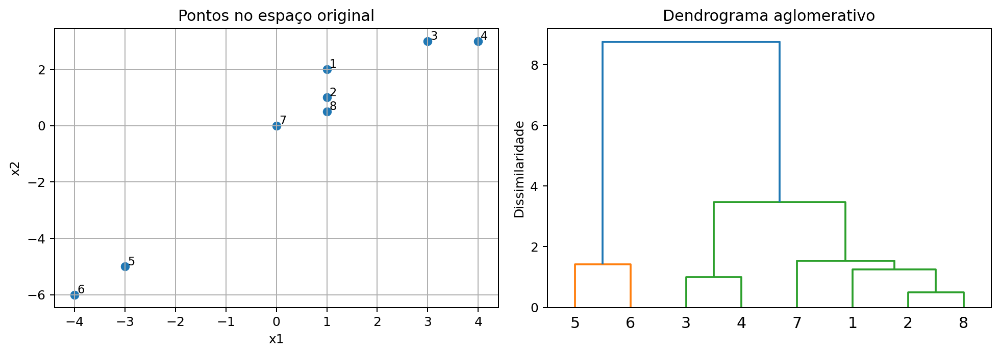

### 9.2. Exemplo da aula com quatro pontos

Os slides usam quatro pontos:

```text
1: [1, 2]
2: [1, 1]
3: [3, 3]
4: [4, 3]
```

Matriz de distâncias ao quadrado:

|   | 1 | 2 | 3 | 4 |
|---|---:|---:|---:|---:|
| 1 | 0 | 1 | 5 | 10 |
| 2 | 1 | 0 | 8 | 13 |
| 3 | 5 | 8 | 0 | 1 |
| 4 | 10 | 13 | 1 | 0 |

O algoritmo identifica primeiro os pares mais próximos:

- pontos `1` e `2`;
- pontos `3` e `4`.

Depois calcula centroides:

```math
c_{1,2} = [1, 1.5]
```

```math
c_{3,4} = [3.5, 3]
```

No final, une os dois grupos maiores.

### 9.3. Por que o dendrograma é útil?

O professor destacou que em dados bidimensionais podemos olhar o gráfico, mas dados reais quase nunca são bidimensionais.

O dendrograma ajuda porque permite visualizar a estrutura de agrupamento mesmo em dados de muitas dimensões.

Também permite analisar diferentes níveis da hierarquia. Dependendo da aplicação, pode fazer sentido cortar a árvore em mais ou menos grupos.

---

## 10. K-Means

### 10.1. Definição

O K-Means busca particionar `N` dados em `K` clusters.

A ideia é que:

- padrões no mesmo cluster sejam parecidos;
- padrões em clusters diferentes sejam diferentes.

Formalmente:

```math
X = \{x_i\}_{i=1}^{N}, \quad x_i \in \mathbb{R}^D
```

Queremos particionar `X` em:

```math
C = \{C_k\}_{k=1}^{K}
```

Com restrições:

- nenhum cluster vazio;
- clusters não se intersectam;
- a união de todos os clusters cobre os dados.

### 10.2. Erro de quantização ou reconstrução

O critério usado pelo K-Means é:

```math
J(C) = \sum_{k=1}^{K}\sum_{x_i \in C_k}\|x_i - m_k\|^2
```

Em que `m_k` é o centroide do cluster `k`.

Esse erro mede o quanto os pontos estão distantes dos centroides. Quanto menor, mais coeso é o agrupamento.

O professor também chamou isso de:

- **erro de quantização**: porque representamos vários dados por um único protótipo;
- **erro de reconstrução**: porque avaliamos o erro de reconstruir o dado pelo centroide.

### 10.3. Algoritmo de Lloyd

O K-Means é normalmente resolvido pelo algoritmo de Lloyd.

Ele alterna dois passos:

1. **Atribuição**: associa cada ponto ao centroide mais próximo.
2. **Atualização**: recalcula cada centroide como a média dos pontos do cluster.

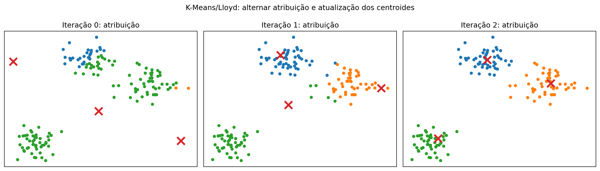

Pseudoalgoritmo:

```text
Escolha K centroides iniciais.
Enquanto não convergir:
    1. Atribua cada ponto ao centroide mais próximo.
    2. Recalcule cada centroide como a média dos pontos atribuídos a ele.
```

Em Python, uma implementação conceitual seria:

```python
import numpy as np

def kmeans_simples(X, K, n_iter=100, random_state=42):
    rng = np.random.default_rng(random_state)
    indices = rng.choice(len(X), size=K, replace=False)
    centroides = X[indices]

    for _ in range(n_iter):
        distancias = ((X[:, None, :] - centroides[None, :, :]) ** 2).sum(axis=2)
        rotulos = distancias.argmin(axis=1)

        novos_centroides = np.array([
            X[rotulos == k].mean(axis=0)
            for k in range(K)
        ])

        if np.allclose(centroides, novos_centroides):
            break

        centroides = novos_centroides

    return rotulos, centroides
```

### 10.4. Convergência

O professor destacou que o K-Means possui **convergência monotônica garantida**.

Monotônica significa que o valor da função objetivo não piora a cada iteração. O algoritmo vai alternando atribuição e atualização até estabilizar.

### 10.5. Problema de mínimos locais

Apesar de convergir, o K-Means resolve um problema não convexo. Portanto, ele pode convergir para mínimos locais.

Para reduzir esse problema:

- usar múltiplas inicializações;
- usar inicialização cuidadosa;
- usar K-Means++.

### 10.6. K-Means++

O K-Means++ escolhe centroides iniciais de forma mais cuidadosa:

1. escolhe o primeiro centroide aleatoriamente;
2. escolhe os próximos com probabilidade proporcional à distância ao centroide mais próximo.

A ideia é iniciar os centroides mais espalhados.

### 10.7. Como escolher K?

O professor deixou claro que escolher `K` é uma questão importante.

Algumas estratégias práticas:

- método do cotovelo;
- silhouette score;
- análise da aplicação;
- conhecimento especialista.

Exemplo:

```python
from sklearn.cluster import KMeans
from sklearn.metrics import silhouette_score

scores = []

for k in range(2, 10):
    modelo = KMeans(n_clusters=k, random_state=42, n_init=10)
    labels = modelo.fit_predict(X)
    score = silhouette_score(X, labels)
    scores.append((k, score))

print(scores)
```

---

## 11. Limitações do K-Means e GMM

### 11.1. Limitação geométrica

O K-Means tende a funcionar bem quando os clusters são aproximadamente esféricos, compactos e separados.

Quando os clusters são alongados, curvos ou têm formatos complexos, o K-Means pode fazer uma divisão ruim.

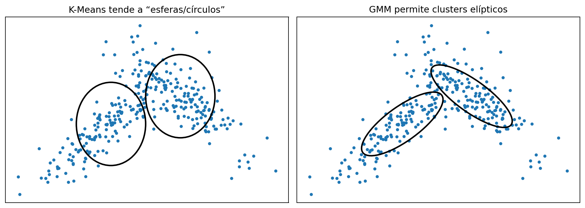

### 11.2. GMM

A GMM, ou **Gaussian Mixture Model**, usa uma mistura de gaussianas.

Ela é mais flexível porque consegue representar clusters elípticos, não apenas regiões esféricas.

Além disso, a GMM pode ser usada como modelo generativo: depois de estimar a distribuição, é possível gerar novos dados a partir dela.

### 11.3. Detecção de anomalias

O professor comentou que modelos probabilísticos como GMM também podem ajudar na detecção de anomalias.

Se um ponto cai em uma região de baixa verossimilhança, ele pode ser considerado pouco esperado, possivelmente anômalo.

---

## 12. Seleção e combinação de atributos

Antes de entrar no PCA, o professor discutiu redução de dimensionalidade por **seleção** ou **combinação** de atributos.

### 12.1. Por que reduzir dimensionalidade?

Muitos problemas possuem grande quantidade de atributos:

- imagens;
- textos;
- dados clínicos;
- dados biológicos.

Isso pode causar:

- dificuldade de otimização;
- overfitting;
- aumento de custo computacional;
- aumento de armazenamento;
- maldição da dimensionalidade.

### 12.2. Seleção de atributos

A seleção escolhe um subconjunto dos atributos originais.

Tipos:

| Abordagem | Ideia |
|---|---|
| Filter | Seleciona atributos por um critério independente do modelo |
| Wrapper | Seleciona atributos avaliando um modelo específico |
| Embedded | O próprio modelo seleciona atributos durante o treinamento |

### 12.3. Fisher Score

O Fisher Score foi apresentado como abordagem **filter**.

A ideia é que um bom atributo para classificação tenha:

- valores parecidos dentro da mesma classe;
- valores diferentes entre classes.

A fórmula apresentada foi:

```math
S_d =
\frac{\sum_{k=1}^{K} N_k(\mu_{dk} - \mu_d)^2}
{\sum_{k=1}^{K} N_k\sigma^2_{dk}}
```

Em que:

- `mu_d`: média do atributo `d`;
- `mu_dk`: média do atributo `d` na classe `k`;
- `sigma²_dk`: variância do atributo `d` na classe `k`;
- `N_k`: número de exemplos da classe `k`.

Queremos `S_d` alto:

- numerador alto: classes separadas;
- denominador baixo: classes coesas internamente.

### 12.4. Wrapper e busca gulosa

Na abordagem wrapper, a seleção de atributos é feita para um modelo específico.

O professor alertou que não é boa prática selecionar atributos para um modelo e usar automaticamente em outro. A seleção foi otimizada para aquele modelo.

Como testar todos os subconjuntos é caro (`2^D` combinações), usamos heurísticas:

- **Greedy Forward Selection**: começa com poucos atributos e vai adicionando.
- **Greedy Backward Selection**: começa com todos e vai removendo.

Essas estratégias podem ser úteis, mas são custosas porque exigem várias validações cruzadas.

### 12.5. Combinação de atributos

Em vez de selecionar e descartar atributos, podemos combinar os atributos originais em um vetor menor.

Diferença central:

| Estratégia | O que faz? |
|---|---|
| Seleção | joga fora alguns atributos |
| Combinação | usa os atributos originais para criar novos atributos menores |

O PCA entra nesse segundo grupo.

---

## 13. PCA

### 13.1. Ideia geral

PCA significa **Principal Component Analysis**, ou **Análise de Componentes Principais**.

É um método não-supervisionado que cria novos atributos a partir de combinações lineares dos atributos originais.

Nos slides, o PCA também aparece como **Transformada de Karhunen-Loève**.

A ideia central é:

> a informação importante está na variação dos dados.

Se um atributo é igual para todos os exemplos, ele não ajuda a diferenciar padrões. Se um atributo varia bastante, provavelmente carrega mais informação.

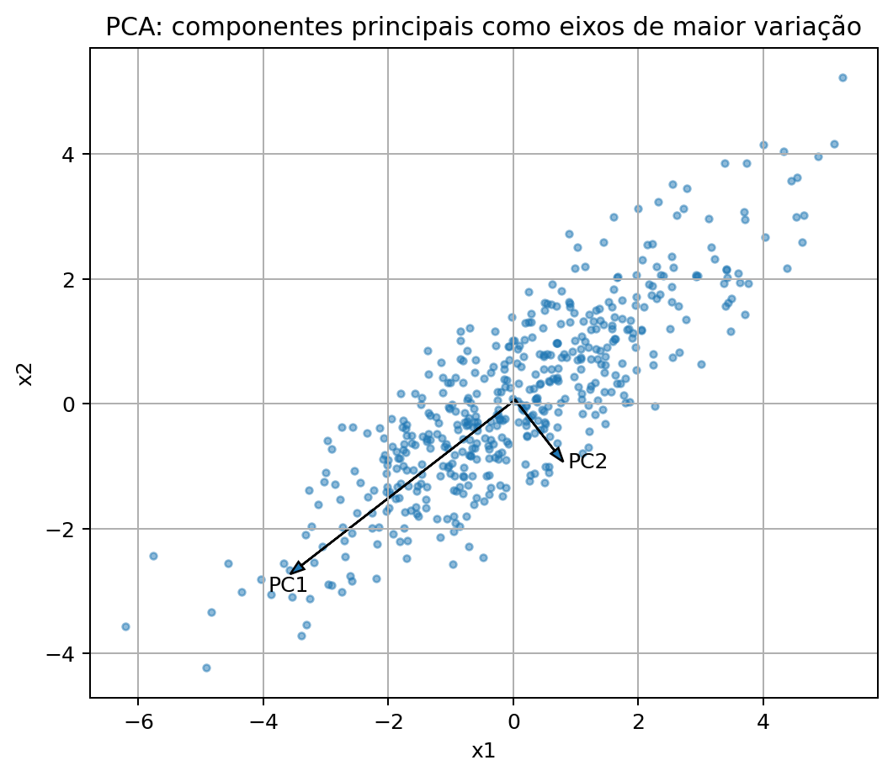

### 13.2. Projeção linear

Queremos transformar dados de dimensão `D` em dados de dimensão `M`, com `M <= D`.

```math
z_i = P x_i
```

Em que:

- `x_i ∈ R^D` é o dado original;
- `z_i ∈ R^M` é o dado projetado;
- `P ∈ R^{M x D}` é a matriz de projeção.

Se `M < D`, há redução de dimensionalidade.

### 13.3. Critério do PCA

O PCA escolhe a projeção que maximiza a variância dos dados projetados.

Para a primeira componente:

```math
z_{i1} = p_1^T x_i
```

A variância projetada pode ser escrita como:

```math
\sigma_1^2 = p_1^T \Sigma p_1
```

Em que `Sigma` é a matriz de covariância dos dados.

Para evitar que a variância cresça apenas aumentando a norma de `p_1`, impomos:

```math
p_1^T p_1 = 1
```

O problema fica:

```math
\max_{p_1} p_1^T \Sigma p_1
\quad \text{sujeito a} \quad p_1^T p_1 = 1
```

Usando multiplicador de Lagrange, chegamos a:

```math
\Sigma p_1 = \lambda_1 p_1
```

Ou seja, `p_1` é autovetor da matriz de covariância.

### 13.4. Autovalores e variância explicada

A variância projetada na componente é igual ao autovalor correspondente:

```math
\sigma_1^2 = \lambda_1
```

Logo, a primeira componente principal é o autovetor associado ao maior autovalor.

As próximas componentes são os autovetores seguintes, ordenados por autovalores decrescentes.

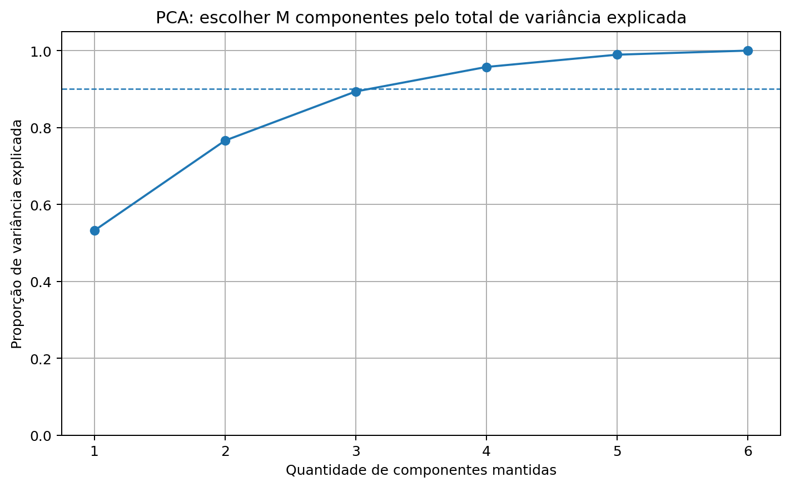

### 13.5. Algoritmo do PCA

1. Centralizar os dados pela média.
2. Calcular a matriz de covariância.
3. Obter autovalores e autovetores.
4. Ordenar os autovetores pelos maiores autovalores.
5. Escolher os `M` primeiros autovetores.
6. Formar a matriz de projeção `P`.
7. Projetar os dados.

### 13.6. Normalização

Os slides recomendam normalizar os dados antes da estimação do PCA.

Isso é importante porque atributos em escalas maiores podem dominar a variância.

### 13.7. Exemplo com scikit-learn

```python
from sklearn.preprocessing import StandardScaler
from sklearn.decomposition import PCA
from sklearn.pipeline import Pipeline

pipeline = Pipeline([
    ("scaler", StandardScaler()),
    ("pca", PCA(n_components=0.95)),
])

X_reduzido = pipeline.fit_transform(X)
print(X_reduzido.shape)
```

Nesse exemplo, `n_components=0.95` mantém componentes suficientes para explicar 95% da variância.

### 13.8. Reconstrução

Os slides também mostram a ideia de reconstruir os dados a partir da projeção:

```math
\hat{x}_i = \mu + P^T z_i
```

Quando `M < D`, essa reconstrução perde parte da informação, mas pode preservar a estrutura principal dos dados.

---

## 14. Projeto de sistemas de aprendizado de máquina

A última parte da aula mudou o foco: em vez de estudar apenas modelos, o professor falou sobre projeto e aplicação de algoritmos de aprendizagem.

A ideia central foi que um projeto real de ML envolve muito mais do que treinar um modelo.

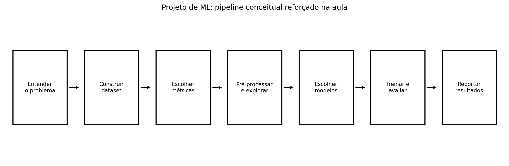

### 14.1. Entender o problema

Antes de usar ML, é preciso responder:

- Qual pergunta queremos responder?
- Essa pergunta faz sentido?
- Há conhecimento especialista disponível?
- Qual literatura se relaciona ao problema?
- Quais são as variáveis independentes?
- Quais são as variáveis dependentes?
- Aprendizado de máquina é realmente necessário?

Essa última pergunta é importante. Nem todo problema precisa de ML.

### 14.2. Construir um conjunto de dados manipulável

Depois, precisamos construir um dataset de fácil manipulação.

Questões importantes:

- quais dados disponíveis são úteis?
- como medir as variáveis?
- como minerar dados?
- como rotular dados?
- como armazenar, versionar e disponibilizar os dados?

### 14.3. Escolher métricas adequadas

As métricas precisam ser coerentes com a pergunta original.

O professor reforçou equilíbrio entre análise quantitativa e qualitativa.

Exemplos:

- classificação: acurácia, precisão, revocação, F1, AUC, matriz de confusão;
- regressão: MSE, MAE, análise de resíduos;
- problemas probabilísticos: métricas que avaliem incerteza.

### 14.4. Analisar e pré-processar os dados

Etapas comuns:

- estatísticas básicas;
- visualização exploratória;
- representação adequada dos dados;
- transformação da variável dependente;
- normalização;
- tratamento de outliers;
- tratamento de dados faltantes;
- seleção ou combinação de atributos;
- análise de desbalanceamento.

### 14.5. Escolher modelos

A orientação dos slides foi começar por abordagens simples.

Também é importante:

- manter coerência com a aplicação final;
- conhecer premissas e limitações de cada modelo;
- testar múltiplas estratégias de forma sistemática.

### 14.6. Treinar e avaliar

A aula reforçou vários cuidados:

- ajustar hiperparâmetros com `grid search`, `random search` ou otimização Bayesiana;
- manter teste separado de validação;
- usar validação cruzada aninhada quando apropriado;
- normalizar validação/teste usando estatísticas do treino;
- automatizar o procedimento;
- armazenar e visualizar resultados.

### 14.7. Reportar resultados

Os slides recomendam reportar:

- tabelas com média e desvio padrão;
- matriz de confusão em classificação;
- análise de resíduos em regressão;
- curvas, histogramas, boxplots e figuras ilustrativas.

Isso explica por que, nas listas, o professor pede notebook com códigos executados, gráficos e tabelas visíveis.

---

## 15. MLOps e desafios reais

### 15.1. Reprodutibilidade

Os slides destacam:

- automatizar tudo;
- disponibilizar dados e códigos;
- informar versões de software;
- fixar `random seed` em algoritmos estocásticos.

Checklist prático:

```text
[ ] Tenho ambiente virtual?
[ ] Tenho requirements.txt?
[ ] Tenho README explicando como executar?
[ ] Fixei random_state?
[ ] Automatizei treino e avaliação?
[ ] Salvei tabelas e figuras?
[ ] O notebook roda do início ao fim?
```

### 15.2. Quando os resultados não estão bons

Os slides sugerem:

- coletar mais dados;
- rever ou recombinar atributos;
- verificar overfitting/underfitting;
- analisar cada passo do treinamento;
- analisar erros e possíveis causas;
- testar outra função custo;
- testar outra família de modelos.

### 15.3. Débito técnico em ML

O professor apresentou a ideia de débito técnico em sistemas de aprendizado de máquina.

Pontos citados:

- erosão de fronteiras;
- acoplamento;
- consumidores não declarados;
- dependências relacionadas a dados;
- fontes instáveis;
- dependências subutilizadas;
- loops de realimentação;
- glue code;
- pipeline jungles;
- dívidas de configuração;
- mudanças no mundo externo.

A mensagem é que sistemas de ML em produção não são apenas “modelo + predict”. Há todo um ecossistema de dados, código, configuração, monitoramento e manutenção.

### 15.4. MLOps

MLOps é o conjunto de práticas para disponibilizar e manter modelos de ML de maneira confiável e eficiente em ambientes reais.

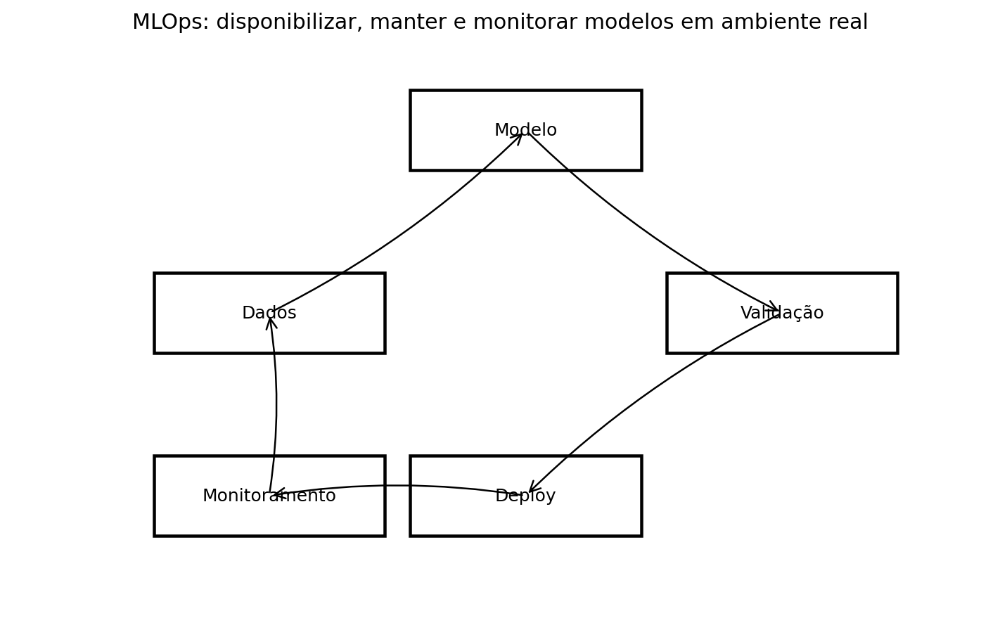

Envolve:

- desenvolvimento do modelo;
- preparação para produção;
- deploy;
- monitoramento;
- feedback loop;
- detecção de degradação;
- detecção de drift.

### 15.5. Ética, segurança e confiança

Os slides também destacam desafios transversais:

- ética;
- regulação;
- vieses;
- autoria;
- tomada de decisão;
- confiança dos usuários;
- explicabilidade;
- segurança;
- data poisoning;
- roubo de modelo;
- inversão de modelo.

Esses temas mostram que um projeto de ML precisa considerar efeitos técnicos, sociais, legais e operacionais.

---

## 16. Conexão com a Lista 03

A Lista 03 pede avaliação de:

- MLP;
- SVM;
- Random Forest;
- Gradient Boosting.

A aula do dia 29/05 ajuda diretamente em dois desses modelos:

- **Random Forest**: explicado como bagging de árvores de decisão;
- **Gradient Boosting**: explicado como boosting sequencial que aprende erros ou pseudo-resíduos.

Além disso, a parte de projeto orienta a forma de entregar a lista:

- usar validação cruzada;
- ajustar hiperparâmetros adequadamente;
- manter teste separado do ajuste;
- reportar média e desvio padrão;
- gerar gráficos e tabelas;
- usar notebook executado;
- automatizar código;
- documentar o projeto.

Exemplo de estrutura alinhada à aula:

```text
lista-03-mlp-svm-ensembles/
├── data/
├── notebooks/
├── outputs/
├── figures/
├── scripts/
├── src/
├── README.md
└── requirements.txt
```

---

## 17. Resumo final

A última aula fechou o módulo mostrando que:

1. **Comitês** combinam modelos para melhorar generalização.
2. Bons comitês precisam de **acurácia individual** e **diversidade**.
3. **Bagging** promove diversidade por amostragem bootstrap e costuma reduzir variância.
4. **Random Forest** é bagging de árvores com amostragem de dados e atributos.
5. **Boosting** treina modelos em sequência, focando erros anteriores.
6. **AdaBoost** aumenta peso dos exemplos errados.
7. **Gradient Boosting** treina modelos para prever pseudo-resíduos.
8. **Aprendizado não-supervisionado** trabalha sem pares entrada/saída.
9. **Agrupamento** busca estruturas e grupos nos dados.
10. **K-Means** alterna atribuição de pontos e atualização de centroides.
11. **PCA** projeta dados em componentes de maior variância.
12. Projetos reais de ML exigem **dados, métricas, avaliação, reprodutibilidade, monitoramento e manutenção**.

